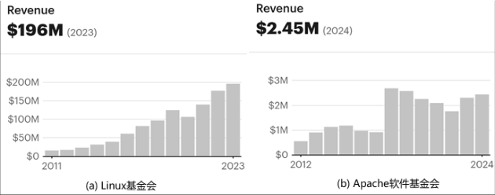
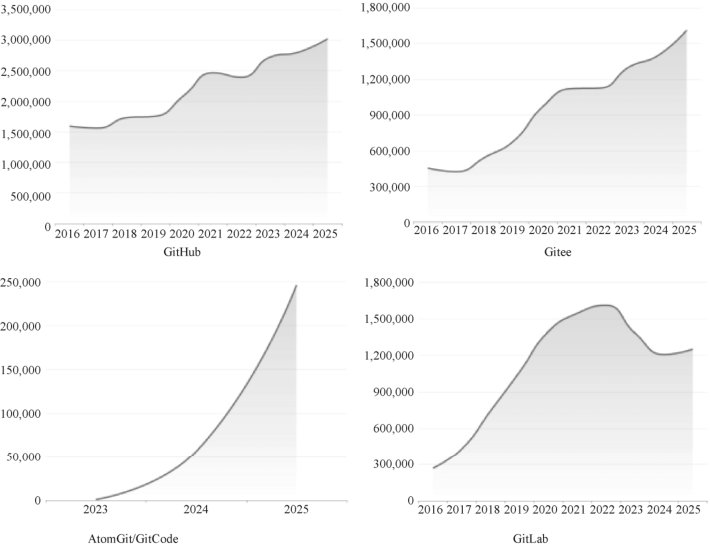
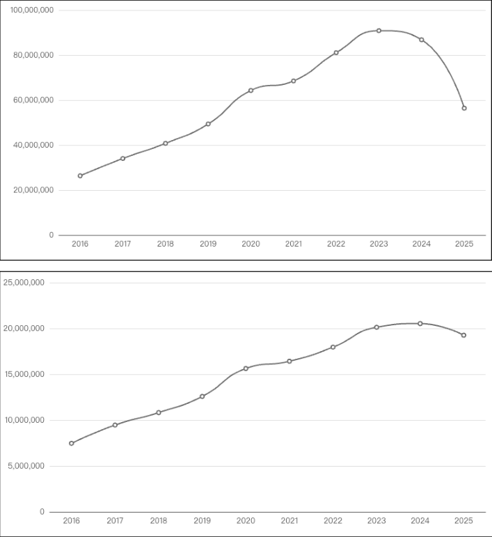

# 第3问 开源软件目前的发展状况如何

## 编辑摘要（新增，非原文）

本问围绕“开源软件目前的发展状况如何”展开，依次讨论开源在全球范围内的成功；全球开源进入成熟化平台期，AI 开源成为新增长极；开源在中国的发展状况；中国开源的挑战与不足。

## 常见问法（新增检索辅助）

- 开源软件目前的发展状况如何？
- 请介绍开源在全球范围内的成功。
- 请介绍全球开源进入成熟化平台期，AI 开源成为新增长极。
- 请介绍开源在中国的发展状况。

## 原书正文（转录）

> 保留原书观点与历史案例，未作当前事实更新。正文页码按书内印刷页码；PDF页码从1起，等于书内页码加18。图示保留原图，文字说明标为整理转述。

<!-- source: q003; print_pages: 7; pdf_pages: 25–25 -->

简单概要的回答是：开源在当今世界已取得了举世瞩目的成就，但其发展轨迹正呈现出一些新的态势。从全球范围来看，开源无疑是成功的，但整体增长曲线已步入平台期。在中国，开源虽在近年来取得了长足进步，然而因起步相对较晚，且面临国际竞争与地缘政治等诸多挑战，要迈向更高层次也绝非易事。

<!-- source: q003; print_pages: 8; pdf_pages: 26–26 -->

### 3.1 开源在全球范围内的成功

#### 一、技术领域全面崛起

在技术层面，开源的成功令人瞩目。Linux 操作系统堪称开源领域的璀璨明珠，依据Top 500 超级计算机榜单，排名前500 的超级计算机几乎清一色运行Linux 操作系统。在服务器市场，Linux Server 的占有率亦颇为可观，尤其在Web 服务器与云计算领域表现卓越。据市场研究机构估算，其在全球服务器市场的占有率处于70%～80%。尽管在桌面领域长期处于较低水平，仅在2%～3%徘徊，但2024 年7 月StatCounter 发布的数据显示，Linux Desktop 取得了历史性突破，首次逼近4.5%。而在编程语言、开发工具、数据库、中间件、云计算等众多领域，开源技术已然占据主导，呈现出一统天下的格局。在AI 领域，众多开源技术正蓬勃发展，展现出无限的活力与潜力。各个技术领域中的著名开源项目如表3-1 所示。

表3-1 各个技术领域中的著名开源项目

| 技术领域 | 著名开源项目 |
| --- | --- |
| 操作系统 | Linux、FreeBSD、Ubuntu、Android、openEuler、OpenHarmony |
| 编程语言 | Python、Ruby、Rust、Go、Perl、Swift、MoonBit、Cangjie |
| 开发工具 | Git、Vim、Emacs、GCC、LLVM、Visual Studio Code、Eclipse、Jenkins |
| 数据库 | MySQL、PostgreSQL、SQLite、MongoDB、Redis |
| 中间件 | Apache HTTP Server、Nginx、Apache Kafka、RabbitMQ、Apache Tomcat、ZooKeeper |
| 云计算 | OpenStack、Docker、Kubernetes、Prometheus |
| AI | TensorFlow、PyTorch、OpenCV、Llama、Qwen |

#### 二、商业领域硕果累累

开源在商业方面同样成绩斐然。早期，红帽和VA Linux 在IPO 阶段便创造了惊人的商业奇迹。1999 年8 月11 日，红帽公司股票于纳斯达克挂牌上市，当日股价飙升272%。1999 年12 月9 日，其股价更是上涨至每股286 美元。同一日，VA

Linux 股票以30 美元首次公开发行，上市当日股价上涨近700%，创下前所未有的纪录，最高价达320 美元，最终以239 美元收盘。此后，开源企业斩获巨大商业成功的案例不断涌现，如2008 年Oracle 公司以10 亿美元收购MySQL，2009 年VMware 公司以4.2 亿美元收购Spring Source，2018 年Microsoft 公司以75 亿美元收购GitHub，2019 年IBM 公司以340 亿美元收购红帽等。

#### 三、开源基金会蓬勃发展

<!-- source: q003; print_pages: 8–9; pdf_pages: 26–27 -->

众多开源基金会也在蓬勃发展，其中，Linux 基金会（Linux Foundation）和Apache 软件基金会（Apache Software Foundation）极具代表性。ProPublica 数据显示，2022 年Linux 基金会收入达1.77 亿美元，旗下拥有30 多个子基金会，管理着600 多个开源项目；Apache 软件基金会在2023 年的收入达231 万美元，管理着近300 个开源项目，这些开源项目作为全球数字基础设施的关键组成部分，正发挥着不可估量的巨大作用，有力地推动着全球数字化进程。两大开源基金会最近10 年的收入情况如图3-1 所示。

<!-- source: q003; print_pages: 9; pdf_pages: 27–27 -->

**图示文字说明（整理转述）**：图中比较Linux基金会和Apache软件基金会的历年收入。Linux基金会标示2023年收入196M美元；Apache软件基金会标示2024年收入2.45M美元。此处为原书所引历史图表，来源标注ProPublica。

图3-1 两大开源基金会最近10 年的收入情况（来源：ProPublica）

### 3.2 全球开源进入成熟化平台期，AI 开源成为新增长极

近年来，全球开源软件的发展已经不再表现为早期那种单一的高速扩张，而是呈现出“总量继续增长、增速趋于稳定、增长结构重心转移”的新特征。从整体规模看，开源并未停止增长。GitHub《Octoverse 2025》显示，2025 年 GitHub 平台开发者总量已超过 1.8 亿，全年新增开发者数量超过 3600 万，开发者平均每秒新增超过 1 人；同时，全年新增仓库数超过 1.21 亿，公共及开源项目贡献量达到11.2 亿，同比增长13%。这说明全球开源仍保持扩张态势，并未出现绝对意义上的停滞。全球新增活跃开发者变化趋势如图3-2 所示。

**图示文字说明（整理转述）**：图中按GitHub、Gitee、AtomGit/GitCode和GitLab四个平台展示新增活跃开发者趋势。横轴为年份，纵轴为开发者数量；AtomGit/GitCode分图从2023年起，其他分图覆盖2016—2025年。曲线的逐年精确数值未在图上逐点标注，应结合原图及正文读取，不凭曲线估算。

图3-2 2016～2025 年全球新增活跃开发者变化趋势（来源：OpenDigger 平台数据整理）

<!-- source: q003; print_pages: 10; pdf_pages: 28–28 -->

但是，如果从高质量协作网络和开发者互动强度来看，全球开源确实进入了成熟化平台期。《2025 中国开源年度报告》基于OpenDigger/OpenRank 数据指出，GitHub 平台近10 年活跃开发者累计达到2493 万名，国内Gitee/AtomGit/GitCode等平台活跃开发者累计接近1000 万名；2025 年GitHub 新增活跃开发者约 301 万名，较2024 年增长7.73%，增速明显低于早期高速增长阶段。更重要的是，全球开源开发者OpenRank 贡献度在2016～2024 年由747 万提升至2052 万，但2025年回落至约1926 万；OpenRank 影响力在2024 年后也出现回落。这表明开源的“参与人数”和“仓库数量”仍在增长，但跨项目、跨组织的深度协作密度正在进入调整期。全球开源开发者贡献度与影响力变化如图3-3 所示。

**图示文字说明（整理转述）**：上下两幅折线图展示2016—2025年全球开源开发者OpenRank贡献度与影响力的变化。两者在此前增长后于末期下降；图中的精确逐年数值未逐点标注，本资料不将曲线估算值作为事实。

图3-3 2016～2025 年全球开源开发者OpenRank 贡献度变化与影响力变化

（GitHub 平台）（来源：OpenDigger 平台数据整理）

造成这一变化的原因是多方面的。

其一，开源软件的普及率已接近饱和。Black Duck《2025 Open Source Security

<!-- source: q003; print_pages: 10–11; pdf_pages: 28–29 -->

and Risk Analysis》显示，在其审计的商业代码库中，97%包含开源代码，70%的扫描代码来源于开源；OpenLogic《2026 State of Open Source Report》也指出，过去一年98%的组织增加或维持了开源软件使用量。这意味着开源已经从“是否采用”的选择问题，转变为“如何治理、如何维护、如何安全使用”的管理问题。（开源供应链相关的内容详见第17 问和第18 问。）

<!-- source: q003; print_pages: 11; pdf_pages: 29–29 -->

其二，生成式AI 正在改变开源协作方式。一方面，AI 编程助手和自动化工具提高了个人开发效率，降低了原本依赖社区协作完成的部分任务量；另一方面，AI 也推动了开源生态的新一轮扩张。GitHub 数据显示，2025 年已有超过110 万个公共仓库使用LLM SDK，过去一年新增此类项目近69.4 万个，同比增长178%；AI 相关项目成为GitHub 开源增长最快的类别之一。也就是说，传统代码协作增长趋缓，并不意味着开源衰退，而是意味着开源的核心载体正在从“代码仓库”扩展到“模型、数据集、工具链、智能体和推理基础设施”。

其三，开源风险约束明显增强。Black Duck 的审计数据显示，86%的商业代码库包含存在漏洞的开源组件，81%包含高危或严重漏洞，56%存在许可证冲突，91%包含非最新版本的开源组件，90%包含落后当前版本超过10 个版本的组件。随着开源软件成为数字基础设施，基于软件物料清单（Software Bill of Materials，SBOM）进行供应链安全管理、许可证合规治理、依赖治理、长期维护和漏洞响应已经成为全球开源发展的主要约束条件。

因此，全球开源当前的发展状况可以概括为采用率已接近饱和，传统协作增长进入成熟平台期；但AI、模型平台、云原生、开发者工具和基础软件仍在创造新的增长曲线。未来全球开源竞争的关键，不再只是项目数量和代码规模，而是生态治理能力、全球开发者吸引力、供应链安全能力、模型开放程度和长期可持续维护能力。

### 3.3 开源在中国的发展状况

开源在中国的发展有几个关键的阶段：学术推动期、操作系统技术推动期、互联网企业推动期和国家战略推动期。早在1985 年，陈钟教授作为杨芙清院士的硕士和博士研究生参与了AT&T UNIX 操作系统油印纸质版源代码的阅读和分析，成为国内首批UNIX 操作系统内核研究与开发的骨干之一。1992 年，AT&T 贝尔实验室USL/USG 与中国合作，美方将最新开发的UNIX SVR 4.2 版本源代码向中方开放，中方基于此推出了UNIX SVR 4.2 中文版。因此，可以将1992 年认定为“中国开源发展的元年”。

在20 世纪90 年代末至21 世纪初，中国的开源活动主要围绕Linux 操作系统展开。这一时期，国内的技术社区和高校开始关注并推广Linux，培养了一批早期的开源爱好者和开发者。1999 年，国产操作系统迎来了第一次真正的爆发，以Xteam Linux、蓝点Linux、红旗Linux、中软Linux 为代表的众多国产操作系统走上了历史舞台。

随着互联网、云计算、移动互联网等一系列技术热潮的兴起，中国也诞生了不少著名的大公司（如阿里巴巴、华为、百度、腾讯、美团、小米等）的开源项目，以及著名的开源企业（如PingCAP、Kyligence、DAOCloud、飞致云、白鲸开源、涛思数据等）。

<!-- source: q003; print_pages: 12; pdf_pages: 30–30 -->

2020 年6 月，开放原子开源基金会正式成立，成为中国首个在民政部注册的致力于开源产业公益事业的非营利性独立法人机构。同年9 月，华为将其智能终端操作系统基础能力相关代码捐赠给该基金会，项目被命名为OpenHarmony。这标志着中国在开源操作系统领域迈出了重要一步，促进了国内开源生态的进一步繁荣。

《中华人民共和国国民经济和社会发展第十四个五年规划和2035 年远景目标纲要》提到“支持数字技术开源社区等创新联合体发展，完善开源知识产权和法律体系，鼓励企业开放软件源代码、硬件设计和应用服务。”可以看出国家在战略层面对开源的肯定和支持。

2021 年至今，全国各级政府和机构（如国务院、地方政府、科技园区管委会等）陆续发布了关于开源软件和数字经济创新的政策。整体趋势从早期的国家层面指导政策（如“十四五”规划）逐步延伸到地方政府的具体行动计划，聚焦于促进开源软件生态建设、数字经济发展、AI 创新等领域。

在国家层面，强调知识产权保护与运用，推动数字经济、AI、基础技术等重点领域发展。明确支持开源技术在数字经济和社会发展中的重要地位。在地方层面，各地都提出要构建开源平台、开展试点示范工程、完善开源治理生态，加快推进本地软件名城建设，推动相关技术和服务输出。开源政策兼顾产业创新与社会经济发展，展现出较强的系统性。

2024 年以后，中国开源已经从早期的技术引入、社区学习和企业跟随阶段，进入“政策支持、平台建设、企业主导、基础软件突破、AI 开源加速”的体系化发展阶段。根据《2025 中国开源年度报告》，截至2025 年底，中国在GitHub 平台的活跃开发者数量超过210 万，规模位居全球第三；如果加上Gitee/AtomGit/

GitCode 等国内平台，整体活跃开发者数量预计超过350 万，位居全球第二。开放原子开源基金会发布的《中国开源发展深度报告（2024）》也指出，2024 年中国活跃开源开发者数量已超过220 万，北京、上海活跃开源项目均超过50 万个，深圳、杭州均超过20 万个，国内开源创新潜能持续释放。

从平台看，中国开源不再只依赖GitHub。Gitee、AtomGit、GitCode 等国内平台在政企、高校、国产基础软件、合规要求和本土开发者服务方面发挥了越来越重要的作用。《2025 中国开源年度报告》显示，国内Gitee/AtomGit/GitCode 等平台活跃开发者数量累计接近1000 万，活跃仓库规模超过2600 万；其中Gitee 活跃仓库规模在2025 年达到约438.9 万，AtomGit/GitCode 作为新兴平台，在2025 年活跃仓库规模超过60 万，呈现出早期快速扩张特征。

从企业看，中国头部科技企业的开源影响力显著增强。2025 年全球开源企业影响力榜中，华为以89,368.78 的OpenRank 位居全球第二，是唯一进入全球前5名的非美国企业；阿里巴巴位居全球第十。国内榜单中，华为、阿里巴巴、蚂蚁集团、字节跳动、百度、PingCAP、乐鑫、腾讯等企业共同构成了中国开源企业矩阵，如表3-2 所示，覆盖操作系统、AI 框架、云计算、数据库、物联网、向量数据库和开发工具等方向。

<!-- source: q003; print_pages: 13; pdf_pages: 31–31 -->

表3-2 2025 年中国开源企业影响力Top 15

| 排名 | 企业 | OpenRank（含同比变化） | 活跃仓库规模 | 活跃开发者规模 |
| --- | --- | --- | --- | --- |
| 1 | 华为 | 89,368.78（+12,607.45） | 8,273 | 12,716 |
| 2 | 阿里巴巴 | 26,349.25（−5,670.27） | 2,797 | 14,595 |
| 3 | 蚂蚁集团 | 18,679.05（+4,002.61） | 768 | 10,726 |
| 4 | 字节跳动 | 16,625.76（+6,703.16） | 458 | 12,398 |
| 5 | 百度 | 13,651.87（−5,339.68） | 152 | 5,841 |
| 6 | PingCAP | 7,917.36（+1,878.88） | 99 | 845 |
| 7 | 乐鑫 | 6,141.94（+1,226.29） | 171 | 4,293 |
| 8 | 腾讯 | 5,717.46（+1,492.99） | 254 | 4,629 |
| 9 | 飞致云 | 4,945.60（+2,065.73） | 65 | 2,562 |
| 10 | 道客 | 4,558.18（−8,306.29） | 61 | 1,929 |
| 11 | 飞轮数据 | 4,099.92（+873.02） | 11 | 756 |
| 12 | LobeHub | 4,037.59（+231.96） | 26 | 1,865 |
| 13 | 赜睿信息 | 3,561.51（−431.39） | 55 | 1,502 |
| 14 | 开放麒麟 | 3,180.90（−922.31） | 1,283 | 773 |
| 15 | 镜舟 | 2,770.29（−762.91） | 19 | 762 |

从项目看，中国开源的重心正在从应用层项目向基础软件和AI 原生基础设施上移。2025 年中国开源项目影响力榜中，OpenHarmony 位列第一，OpenRank 达60,089.18；openEuler 位列第二，OpenRank 达16,257.57，详表3-3。这表明中国开源已经形成以操作系统为底座、AI 与大模型生态为先锋、数据库和中间件为支撑的立体化格局。

表3-3 2025 年中国开源项目影响力Top 15

| 排名 | 项目 | OpenRank | 开发者规模 | 发起组织 |
| --- | --- | --- | --- | --- |
| 1 | OpenHarmony | 60,089.18 | 6,487 | 开放原子开源基金会 |
| 2 | openEuler | 16,257.57 | 3,285 | 开放原子开源基金会 |

<!-- source: q003; print_pages: 14; pdf_pages: 32–32 -->

续表

| 排名 | 项目 | OpenRank | 开发者规模 | 发起组织 |
| --- | --- | --- | --- | --- |
| 3 | MindSpore | 8,064.37 | 1,211 | 华为 |
| 4 | PaddlePaddle | 7,305.94 | 3,168 | 百度 |
| 5 | Apache Doris | 4,031.07 | 747 | 阿帕奇软件基金会 |
| 6 | ModelScope | 3,681.64 | 3,732 | 阿里巴巴 |
| 7 | VolcEngine | 3,638.97 | 3,686 | 字节跳动 |
| 8 | Ant Design | 3,288.48 | 3,288 | 蚂蚁集团 |
| 9 | openKylin | 3,180.90 | 773 | 开放原子开源基金会 |
| 10 | TiDB | 3,162.02 | 498 | 平凯星辰 |
| 11 | Anolis OS | 2,996.83 | 514 | 开放原子开源基金会 |
| 12 | verl | 2,785.19 | 2,875 | 字节跳动 |
| 13 | StarRocks | 2,770.29 | 762 | 镜舟 |
| 14 | Milvus | 2,640.81 | 986 | Linux 人工智能与数据基金会 |
| 15 | 1Panel | 2,304.38 | 1,369 | 飞致云 |

尤其值得注意的是，中国在开源AI 与开源模型生态中的地位明显上升。Hugging Face 2026 年春季报告显示，截至2025 年，Hugging Face 已增长至1300万用户，拥有超过200 万个公共模型和超过50 万个公共数据集；过去一年，中国模型在Hugging Face 下载量中占据41%的最大单一份额，并在月度下载和总体下载上超过美国。Qwen 家族衍生模型超过11.3 万个，若按Qwen 标签统计则超过20万个；DeepSeek、Qwen、GLM、Kimi 等中国模型正在成为全球开源AI 生态的重要力量。

从国家和地方政策看，中国开源已经从技术社区议题上升为数字经济、基础软件、AI、产业安全和人才培养的重要组成部分。开放原子开源基金会、开源社、木兰开源社区、各地开源创新中心、高校开源课程和开源实践活动共同推动了开源生态建设。开放原子相关报告指出，开源操作系统、AI 和数据库是中国开源表现突出的三大领域，开源鸿蒙、openEuler、openKylin、OpenAnolis、DeepSeek、千问、TiDB、openGauss、OceanBase 等项目在生态构建和技术影响力方面持续增强。

<!-- source: q003; print_pages: 14–15; pdf_pages: 32–33 -->

综合来看，中国开源已经不再只是全球开源生态的跟随者和使用者，而是在操作系统、AI 模型、数据库、云原生、物联网和开发工具等方向形成了若干具有国际影响力的项目和企业。中国开源的阶段性特征可以概括为：开发者规模全球领先，基础软件项目开始突破，AI 开源形成全球影响，企业和基金会成为生态核心力量，但国际化协作深度和全球社区治理能力仍需提升。

<!-- source: q003; print_pages: 15; pdf_pages: 33–33 -->

### 3.4 中国开源的挑战与不足

中国开源在快速发展的同时，仍面临多重结构性挑战。

第一，顶级项目数量和全球生态吸引力仍然不足。2025 年全球开源项目影响力Top 100 中，美国项目有49 个，中国项目有12 个，虽然中国已位居第二，但与美国仍有明显差距。

第二，核心技术原创能力仍需加强。中国已经在OpenHarmony、openEuler、PaddlePaddle、MindSpore、ModelScope、DeepSeek、Qwen、TiDB、Milvus 等方向取得突破，但在全球开源底层生态中，美国仍然在AI 框架、编译器、云原生、开发者工具链、芯片软件生态等关键领域占据主导地位。《2025 中国开源年度报告》也指出，中美技术话语权呈现结构性分化：中国在AI 大模型、操作系统、分布式数据库等方向快速追赶，部分领域实现并跑甚至局部领跑，但美国在PyTorch、Kubernetes、编译器等底层领域仍具优势。

第三，开源人才体系仍存在“使用者多、维护者少、国际化开源维护者少”的问题。2025 年开源社问卷显示，受访者中“使用者”和“贡献者”比例较高，但维护者、生态运营者等深度角色仍然有限；在高校开源实践方面，超过六成受访者没有参加过相关活动，说明开源教育和实践活动的覆盖面仍有较大提升空间。开源生态真正需要的不只是会使用开源软件的开发者，而是能够长期维护项目、制定路线图、进行代码评审、处理安全漏洞、组织社区协作、参与国际治理的核心贡献者。

第四，开源供应链安全和合规风险更加突出。随着开源被广泛用于金融、电信、政务、工业、汽车、医疗和AI 等关键场景，依赖漏洞、传递依赖、许可证冲突、组件停更、恶意包投毒等问题会直接影响企业和公共部门的安全韧性。Black

Duck 的数据表明，64%的开源组件是传递依赖，56%的审计代码库存在许可证冲突，91%的代码库包含过时开源组件。这意味着企业不能再把开源治理视为研发团队的自发行为，而需要建立SBOM、SCA、漏洞响应、许可证审查、依赖升级和安全例外审批等制度化流程。

<!-- source: q003; print_pages: 15–16; pdf_pages: 33–34 -->

第五，AI 开源带来了新的定义、治理和安全挑战。模型开源并不等同于传统软件开源，开放权重、开放推理代码、开放训练代码、开放数据集、开放评测体系之间存在明显差异。OSI 已发布Open Source AI Definition 1.0，强调AI 系统应当赋予使用、研究、修改和分享的自由，并指出传统软件许可证视角不足以完全保障AI 系统的开放性；同时，OSI 也明确提出要警惕“openwashing”，即企业将并不符合开源自由原则的AI 系统包装为“开源”。中国大模型在全球影响力提升的同时，也必须面对训练数据可追溯、模型许可证清晰度、衍生模型合规、安全评测、滥用防护和国际社区信任等问题。

<!-- source: q003; print_pages: 16; pdf_pages: 34–34 -->

第六，商业化和社区可持续性仍需平衡。开源项目不能只依赖企业短期投入或开发者热情，还需要稳定的商业闭环、基金会治理、维护者激励、社区中立性和长期路线图。OpenLogic《2026 State of Open Source Report》指出，随着开源采用成熟，组织关注点正在从“是否使用开源”转向“如何可持续地管理开源”；近半数受访组织把50%以上时间用于维护和修复缺陷，20%的组织没有正式CVE 处理流程。这一趋势对中国开源同样适用：没有持续维护能力的开源项目，很难从“开源发布”走向“生态成功”。

综上所述，中国开源产业接下来的重点，不应只是继续扩大项目数量和开发者规模，而应转向高质量发展：提升原创技术能力，孵化国际化顶级项目，培养核心维护者和社区治理人才，完善供应链安全和许可证合规体系，推动AI 开源的透明化与标准化，并通过基金会、企业、政府、高校和社区之间的协同机制，形成可持续、可信任、可国际协作的开源生态。只有这样，中国开源才能真正从“使用开源、参与开源”进一步走向“贡献开源、治理开源、引领开源”。

## 来源与整理说明

来源：《解码开源：开源生态60问》，庄表伟，第3问；书内第7–16页；PDF第25–34页。
拟定网页路径：`/questions/q003/`（尚未发布）。
摘要、关键词、常见问法与图示说明为新增整理内容；正文与表格保留原稿内容。