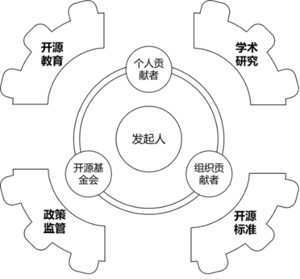

# 第10问 开源生态系统包括哪些关键角色

## 编辑摘要（新增，非原文）

本问围绕“开源生态系统包括哪些关键角色”展开，依次讨论从“个人”与“组织”维度分类；从“教育、学术与政策”视角扩展出的角色；角色之间的交互与多重身份。

## 常见问法（新增检索辅助）

- 开源生态系统包括哪些关键角色？
- 请介绍从“个人”与“组织”维度分类。
- 请介绍从“教育、学术与政策”视角扩展出的角色。
- 请介绍角色之间的交互与多重身份。

## 原书正文（转录）

> 保留原书观点与历史案例，未作当前事实更新。正文页码按书内印刷页码；PDF页码从1起，等于书内页码加18。图示保留原图，文字说明标为整理转述。

<!-- source: q010; print_pages: 36; pdf_pages: 54–54 -->

开源生态作为一个社会经济系统，也是一个不断生长的概念，从最初的开源项目发起人，到后来越来越多的参与者，以及出于各种不同的理由不断加入的各种角色，发展到今天已经形成一个非常复杂的生态系统了，如图10-1 所示。

**图示文字说明（整理转述）**：图中以发起人为中心，关联个人贡献者、组织贡献者及开源基金会；外围包括开源教育、学术研究、政策监管和开源标准，说明开源生态由多种角色共同构成。

图10-1  开源生态系统中的关键角色

### 10.1 从“个人”与“组织”维度分类

个人扮演的角色（个人贡献者）包括以下几类。

<!-- source: q010; print_pages: 36–37; pdf_pages: 54–55 -->

- 项目发起者（Project Initiator）。提出开源项目的创意或需求，制定初始目标与规划，他们通常还是这个项目的第一行代码的撰写者、最初的文章作者。他们可能在项目初期身兼多职（如核心维护者、布道者等），直到项目发展壮大之后，再将一些角色分配给他人。

<!-- source: q010; print_pages: 37; pdf_pages: 55–55 -->

- 维护者/核心开发者（Maintainer/Core Developer）。负责项目整体的技术决策、代码审阅、版本发布等，是项目的长期、核心贡献者，具备合并代码、管理社区贡献的权限，是一个项目中最为重要的角色。

- 贡献者（Contributor）。在社区中做出各种贡献的人，包括提交代码、撰写文档、测试、翻译、设计、社区运营等多种形式。他们的努力将推动项目不断完善与进步，通常一个项目的贡献者数量，决定这个开源社区的整体规模。

- 安全审计员/专家（Security Auditor/Experts）。在开源项目中承担对代码和系统进行专业审查的工作，包括漏洞检测、依赖分析、风险评估等。他们不仅发现潜在安全隐患，还会为核心维护者和贡献者提供修复建议或安全增强方案，使得项目更可靠、抗风险能力更强。随着开源项目在关键基础设施和商业应用中广泛部署，安全专家的作用愈发重要。

- 漏洞报告者/白帽黑客（Bug Bounty Hunter/Ethical Hacker）。这些人通常以悬赏形式或出于责任感，自发地对开源项目进行渗透测试或漏洞挖掘。发现漏洞后，他们会在公开披露前私下通知项目维护者，以便及时修补，防止恶意利用。相应的漏洞奖励机制也激励更多人参与此类正向行为，从而提升整体安全水平。

- 社区经理（Community Manager）。在社区发展到一定规模后，项目发起人或核心维护者已经没有精力过多关注社区运营工作，此时社区经理的角色变得至关重要。他们关注社区健康与活跃度，组织活动、协调沟通、解决冲突，负责帮助新成员融入社区，促进多元化与包容性等工作。

- 用户（User）。开源软件或项目成果的使用者，包括个人开发者、早期尝鲜者、普通爱好者或测试者，他们通过反馈意见、提交漏洞报告和需求建议，推动项目改进。

- 布道者（Evangelist/Advocate）。有特定开源项目的布道者，也有专门的开源布道者，他们通过会议演讲、技术文章、社群活动等方式，向外界推广项目和开源理念，对吸引潜在用户与贡献者、提升项目影响力起到关键作用。

- 导师（Mentor）。当一个项目被捐赠给开源基金会之后，基金会往往会指派经验丰富的导师，以“传帮带”形式指导新贡献者或核心成员，帮助他们熟悉项目结构与贡献流程。他们所扮演的这样的角色，能够有力地保障社区的可持续发展与人才培养。

组织所扮演的角色（组织贡献者）包括以下几类。

<!-- source: q010; print_pages: 37–38; pdf_pages: 55–56 -->

- 企业（Enterprise/Company）。企业是开源生态中最常见的组织参与者之一。它们既可能作为开源项目的重要用户，也可能直接参与到项目的维护与贡献中。许多大型企业会投入资源，专门组建或赞助开源项目团队，通过提供资金、基础设施或技术专家的方式来支持社区。企业通常具备较强的市场影响力，当它们采用并推广某个开源项目时，往往能带来巨大且快速的用户增长。同时，企业在开源项目中汲取的技术收益或品牌价值，也能够反哺其自身的产品与创新。

<!-- source: q010; print_pages: 38; pdf_pages: 56–56 -->

- 赞助商与捐赠者（Sponsors/Donors）。这类角色通过资金、服务器资源或其他形式的支持，来帮助开源社区减轻运维或开发成本压力。他们可能是个人，也可能是机构、企业或基金会，出发点既可能是公益理念，也可能是战略考量。赞助商与捐赠者的支持通常能使核心维护者和社区经理更专注于项目本身，从而帮助项目取得更长远、稳健的发展。一些赞助计划也会配合社区激励机制，如定期透明披露经费使用，或推出贡献者的“奖金池”，在鼓励创新的同时确保社区的公开与公正。

- 生态合作方（Ecosystem Partners）。这部分角色既有可能是商业公司，也可能是技术联盟或解决方案提供商，它们与开源项目形成互补关系，共同构建产业生态。例如，云服务厂商为开源项目提供免费或优惠的服务器资源，CI/CD 平台为开源项目提供自动化测试和集成工具，安全厂商提供漏洞扫描和防护机制，律师事务所提供开源合规咨询服务等。合作伙伴与生态合作方的存在，使得开源项目在行业落地时更具竞争力，也让项目与市场需求无缝对接，为社区带来更多的潜在用户与贡献者。

- 社区组织或非营利组织（Community/NPO）。这些组织通常专注于公益、教育或社会事业，往往通过协调志愿者、组织开源活动或项目竞赛等方式，促进开源文化的传播与社区的多元化。非营利组织常承担“桥梁”角色，一方面为社区成员提供各种资源和培训，另一方面也帮助社区凝聚力量、提升影响力。在一些情况下，非营利组织还会与政府或行业协会合作，推动开源在公共政策或行业标准层面的落地，为开源生态带来更广泛的社会价值。

- 开源基金会（Open Source Foundations）是一类特殊的组织贡献者。开源基金会是开源生态中提供法律与治理支持的重要力量，如Linux 基金会（Linux Foundation）、Apache 软件基金会（Apache Software Foundation）、Mozilla 基金会（Mozilla Foundation）等。它们在保护项目商标、维护版权及管理许可证等方面具有丰富的专业经验。开源基金会通常提供一系列项目治理模式，让开源项目能够在更透明、更民主的机制下运转。有些开源基金会还设立导师团队，帮助新项目迅速上手并建立可持续的发展架构。开源基金会往往承担“背书”或“保管人”的角色，使得开源项目在法律和组织层面更加稳健。

### 10.2 从“教育、学术与政策”视角扩展出的角色

开源教育类的角色包括以下几类。

<!-- source: q010; print_pages: 38–39; pdf_pages: 56–57 -->

- 教育者/培训机构（Educator/Training Provider）。这些角色通常活跃于学校、培训机构、在线教育平台和社区活动中，负责教授与开源相关的知识和实践技能。他们可能开设开源课程、组织工作坊或竞赛，以帮助更多人掌握从版本控制（如Git）到项目协作（如Pull Request 流程）等实用技能。通过面对面或在线的授课、辅导，教育者不仅在技术层面提升学生能力，也在精神层面推广开源文化，培养更多潜在的贡献者和核心维护者。

<!-- source: q010; print_pages: 39; pdf_pages: 57–57 -->

- 学习者/学生（Learner/Student）。他们是开源教育的主要受众，包括在校大学生、职业转型者，以及希望通过自学提升开源技能的个人。通过接受培训、参与社区活动或阅读开源文档，学生和学习者逐渐掌握实践技能，并有机会在真实的开源项目中进行实际贡献。对于他们而言，加入开源社区不仅能提高技术水平，也能认识更多志同道合的人，获取更丰富的职业发展机会。

开源学术研究类的角色包括以下几类。

- 研究者/学术贡献者（Researcher/Academic Contributor）。这些角色深入研究开源项目的技术架构、社区治理模式、可持续发展路径等，并在专业刊物或会议上发表论文。他们往往跨越学术与实践的界限，通过量化数据或深度访谈，为开源社区提供可参考的理论框架与改进建议。研究者也可能直接成为开源项目的贡献者，将研究成果转化为新特性或优化方案。

- 学术会议与研讨会（Academic Conference/Workshop）。此类会议专门聚焦于开源系统、开源治理或特定技术领域，如OSS（Open Source Systems，开源系统）系列会议、FOSDEM（欧洲开源开发者大会）等。不同于常规商业会议，学术研讨会更倾向于研究成果交流和前沿思考的碰撞，参会者包括研究者、社区维护者、产业专家。通过论文分享、议题讨论和工作坊等形式，这些会议为学术界与产业界、社区之间的深度融合搭建了重要平台。

开源政策与标准类的角色包括以下两类。

- 政策制定者/监管机构（Policymaker/Regulator）。政府部门或国际组织往往承担法律法规与产业政策的制定职责。它们在数字经济与科技发展的背景下，审视开源软件使用、许可证合规、数据安全等方面的问题，并出台相应政策或标准，以保障公平竞争与创新活力。通过立法或监管，政策制定者为开源社区提供更明确的合规环境，也推动公私部门在开源方面的协同合作。政府或公共部门常在信息化建设与公共服务领域应用开源技术，也可能开放部分公共数据或资源以鼓励公民创新、使用开源软件或将公共项目以开源形式向社会发布等。

- 行业协会/标准化组织（Industry Association/Standards Organization）。这类组织如IEEE、ISO、W3C 等，也包括专业化的垂直领域协会（如金融、医疗、汽车等）。它们会制定或推广行业技术标准，推动开源技术与行业标准的对接，进而提升互操作性和应用广度。对开源项目而言，被行业协会或标准化组织认可，意味着在合规与技术成熟度上获得更高的可信度，有助于在更广阔的行业中推广应用。

<!-- source: q010; print_pages: 40; pdf_pages: 58–58 -->

### 10.3 角色之间的交互与多重身份

开源生态中的各类角色之间是存在交叠的，而且会出现多重身份的情况。

- 个人与组织的交叠。部分看似属于个人的角色（如项目发起者），也可能由企业或基金会承担。事实上，一家企业可以主导项目创立，最初版本的代码也由其核心员工完成。个人在开源生命周期中会历经多种转变：有些人既是核心维护者，又兼任社区经理或布道者；也有人在初期贡献代码，后期则专注于社区运营或项目战略。

- 教育、学术与产业的融合。高校常与企业结成合作关系，为学生提供实习与项目实践的机会；与此同时，研究人员也会在社区中直接贡献代码或进行项目测试，以实现学术与产业的无缝衔接。各类培训机构和社区会联手开展工作坊、编程竞赛等活动，为新人提供更宽广的学习和实践平台，鼓励他们走向贡献者与核心维护者的道路。

- 政策对整个开源生态的影响。无论国家政策、地方政策，还是各类标准（国际、国家、地方与行业标准），对开源生态的影响都是全方位的。由于开源是非常新兴的事物，无论是政策制定还是标准的研发，都会广泛地征询各类开源专家的意见，这也是开源社区的人士影响政策与标准发展的机会。

## 来源与整理说明

来源：《解码开源：开源生态60问》，庄表伟，第10问；书内第36–40页；PDF第54–58页。
拟定网页路径：`/questions/q010/`（尚未发布）。
摘要、关键词、常见问法与图示说明为新增整理内容；正文与表格保留原稿内容。