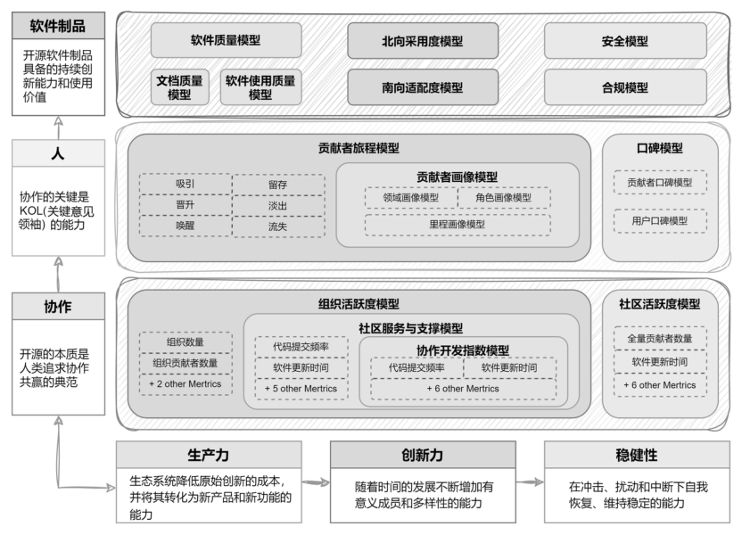

# 第14问 什么是开源项目的健康指标

## 编辑摘要（新增，非原文）

本问围绕“什么是开源项目的健康指标”展开，依次讨论开源项目健康度评估的主流框架；深入思考开源指标体系。

## 常见问法（新增检索辅助）

- 什么是开源项目的健康指标？
- 请介绍开源项目健康度评估的主流框架。
- 请介绍深入思考开源指标体系。

## 原书正文（转录）

> 保留原书观点与历史案例，未作当前事实更新。正文页码按书内印刷页码；PDF页码从1起，等于书内页码加18。图示保留原图，文字说明标为整理转述。

<!-- source: q014; print_pages: 50; pdf_pages: 68–68 -->

开源项目的健康指标是用于全面衡量和评估开源项目可持续性、社区活跃度、代码质量及生态影响力的量化与质性标准。这些指标在开源生态系统中发挥着举足轻重的作用，能够为项目的维护者、贡献者以及各类相关利益者提供深入洞察项目实际情况的有力工具，对于把握项目的当前状况、预测其发展趋势以及提前识别未来潜在风险，都具有重大的价值。

### 14.1 开源项目健康度评估的主流框架

在开源领域，主要有以下一些评估框架在探索如何评估开源项目、开源社区的健康度：最早也是目前发展最活跃的是由Linux 基金会于2017 年8 月发布的“Community Health Analytics in Open Source Software”（开源软件中的社区健康分析，以下简称CHAOSS），还有2021 年3 月红帽公司发布的“衡量开源项目健康状况的清①”正式诞生。

单”。2023 年2 月，我国首个开源生态健康评估平台“OSS Compass① OSS Compass（开源指南针）由国家工业信息安全发展研究中心、开源中国、南京大学、华为、北京大学、新一代人工智能开源开放平台（OpenI）、百度、腾讯开源联合发起并协作开发。

<!-- source: q014; print_pages: 51; pdf_pages: 69–69 -->

#### 一、CHAOSS 指标体系

CHAOSS 是Linux 基金会旗下的项目，专注于通过指标分析来定义社区的健康状况。CHAOSS 项目有以下4 个目标。

- 建立衡量开源社区健康状况的指标和模型。

- 开发用于衡量社区健康状况的开源软件和举措。

- 制订计划，部署无法通过跟踪数据实现的指标。

- 与全球合作伙伴合作，塑造理解开源社区健康的方式。

（1）CHAOSS 的早期阶段。

在早期阶段，CHAOSS 提出了5 个指标领域，并设立了5 个工作组。

- 通用指标工作组（后改名为指标开发工作组，Metrics Development

Working Group），工作重点是确定多个工作组使用的指标或对社区健康非常重要的指标，专注的领域如下。

贡献─确定作出了哪些贡献（如代码提交、维基编辑、文档）。

人员─确定作出贡献的组织和个人（如贡献类型、人口统计等）。

地点─确定贡献发生的物理和虚拟地点（如GitHub、聊天频道、论坛、会议等）。

时间─确定作出贡献的时间（如回复时间）。

- 多样性与包容性工作组（后改名为多样性、公平和包容工作组，Diversity，Equity and Inclusion Working Group），旨在定义衡量标准和方法，以帮助其他人在自己的开源项目中衡量和关注多样性、公平性和包容性，专注的领域如下。

沟通包容性─确定我们如何与贡献者和潜在贡献者沟通。

贡献者社区多样性─确定社区内贡献的多样性，以及如何重视这些不同的贡献。

活动多样性─确定活动的多样性和包容性。

管理─确定我们的管理是否具有多样性和包容性。

领导层─确定我们社区领导层的健康程度。

项目和社区─确定我们的项目场所（社区参与的场所）的多样性和包容性。

表彰优秀作品─确定我们如何表彰/奖励社区中的优秀作品。

- 演进工作组，主要制定评估开源项目生命周期的指标，专注的领域如下。

代码开发活动─了解代码开发活动的类型和频率。

代码开发效率─了解代码开发活动的开发效率。

代码开发流程质量─了解用于提高/审查质量的流程（如测试、代码审查、标记问题、标记发布、响应时间、CII 徽章）。

问题解决─确定社区在解决社区参与者发现的问题方面的效率。

社区增长─确定项目社区的规模，以及它是在增长、缩小还是保持不变。

<!-- source: q014; print_pages: 51–52; pdf_pages: 69–70 -->

- 价值工作组，主要制定衡量标准，描述个人和组织参与开源活动的价值，但是现在已经不再活跃了。

<!-- source: q014; print_pages: 52; pdf_pages: 70–70 -->

- 风险工作组，重点关注与开源中的风险问题相关的衡量标准，专注的领域如下。

业务风险─了解围绕/支持特定软件包的社区的活跃程度。

代码质量─了解特定软件包的质量。

许可─了解与使用特定软件包相关的潜在知识产权问题。

安全─了解与软件开发相关的安全流程和程序。

透明度─了解特定软件包在依赖性、许可证、安全流程等方面的透明度。

依赖性风险评估─了解软件依赖性风险。

#### 二、CHAOSS 的最新发展是“指标平铺，另外建立指标评估模型”

通过阅读上述的分类可以发现，CHAOSS 指标体系存在交叠的现象，如演进工作组与风险工作组关心的内容就存在很多交叠，甚至在风险工作组的内部，与透明度相关的指标也会关注许可的风险。因此，在CHAOSS 的官网上，目前（截至2025 年2 月）的做法是将所有（89 个）指标全部平铺展示，不再分类。另外，越来越多的社区实践者发现，原先对于指标定义的颗粒度过小，不能具体地描述某个社区的实际场景。因此，在2021 年，华为倡议成立了指标评估模型工作组，首次提出了评估模型的概念。经过近两年的发展，到2023 年，CHAOSS 社区把重心转移到了评估模型工作组方向。（来自2023 年4 月笔者对王晔晖的访谈。）截至2025年2 月，CHAOSS 一共发布了17 个指标模型（Metrics Models）。

试举一例，介绍指标模型与指标的关系。开发响应度（Development

Responsiveness）是一个指标模型，这个指标模型的计算结果反映了与项目有效运营和扩展能力相关的一系列因素。响应度可以反映项目的投资（包括放弃）、能力，并且可以指示工程优先级，有时还会偏向于某些类型的交互和人员─响应度可以揭示很多东西，包括你没有注意到的东西，如机器人在解决常见痛点方面的效果（或效果不佳）。

在开发响应度指标模型中，包含如下4 个指标。

（1）变更请求审核周期。审核周期的时间长度衡量的是变更请求中一个完整审核周期所需的时间。一个审核周期从提交或更新变更请求时开始，到接受、拒绝或进一步请求变更时结束。这一指标可帮助维护人员评估代码审核流程的效率，找出潜在的瓶颈和出现延迟的地方。通过了解这些周期的持续时间，可以深入了解审核实践的有效性和项目中贡献的整体工作流程。审核周期中的放弃或半放弃流程，即表示维护者或提交者响应缓慢。

（2）变更请求持续时间。变更请求持续时间是从变更请求开始到结束（被接受并合并到代码库中）的持续时间。这仅适用于已接受的变更请求。

（3）问题响应时间。此指标衡量问题从作者以外的贡献者收到首次回复所需的时间。问题响应时间是衡量项目响应能力及其吸引贡献者的能力的关键指标。响应时间短，可能表明社区健康活跃；响应时间较长，则可能凸显管理社区贡献方面的潜在问题。

<!-- source: q014; print_pages: 52–53; pdf_pages: 70–71 -->

（4）缺陷解决持续时间。缺陷解决持续时间是指从报告软件缺陷到解决缺陷之间的中位时间，解决问题可能通过代码修改（合并修复）或拒绝报告/问题来实现。不同贡献者的问题或报告的解决时间，可突出显示贡献者在处理报告/问题时是否面临延误。每个数据点都与缺陷报告/问题及其相应的解决行动相关联。如果缺陷解决速度较快，则表明项目的维护团队积极主动、反应迅速，有助于提高软件的整体质量和用户满意度。

<!-- source: q014; print_pages: 53; pdf_pages: 71–71 -->

#### 三、对CHAOSS 指标体系的评价

CHAOSS 指标体系是一个非常活跃且依然在快速变化的指标体系。作为一个全球协作的开源项目，CHAOSS 提出的很多关于开源项目健康指标相关的思想都非常值得借鉴。但是由于社区成员的兴趣比较分散，各种各样的指标层出不穷，却难以落地。在开源社区中工作的很多朋友都逐渐产生了疑惑，也不太在实际工作中使用他们的指标体系了。

#### 四、红帽公司发布的衡量开源项目健康状况的清单

2020 年，红帽公司发布了“衡量开源项目健康状况的清单”。相对于CHAOSS，这个清单提出了一个简明扼要的框架（检查清单），将衡量一个开源项目的健康状况分为若干检查项。至于如何进行具体的检查，看起来是一个完全手工的过程。另外，这个检查清单也不提供综合评价的计算方案，或者不同的项目之间如何比较健康度的机制。

#### 五、开源指南针

2023 年推出的开源生态健康评估平台─开源指南针，是一个兼具理论深度与实用价值的平台，由国内的多家高校、企业、开源社区联合打造。开源指南针展示的开源生态评估体系包括开源生态、“协作、人、软件”和评估模型，如图14-1 所示。

**图示文字说明（整理转述）**：图中开源指南针的评估体系分为软件制品、人和协作三个层面，并关联生产力、创新力和稳健性。模型涵盖软件质量、采用度、商业适配度、安全与合规，贡献者数据、画像与口碑，以及组织活跃度、社区服务支持、协作开发和社区活跃度等。

图14-1 开源指南针的开源生态评估体系

<!-- source: q014; print_pages: 54; pdf_pages: 72–72 -->

基于南京大学的陶先平老师、汪亮老师的研究成果，开源指南针的指标体系（v3 版本）针对开源生态健康度构建了社区活力、协作效率、开放治理三大核心维度的模型，其核心思想是：一个健康、可持续发展的开源社区，不仅需要“有人参与、有持续贡献”，还需要具备“高效的协作机制”，以及“开放、多元的治理结构”。整个体系进一步细分为3 个维度、7 个二级评估模型、28 项度量指标，从开发者参与、代码与社区活动、Issue/PR 协作流程，一直延伸到组织和个人参与社区治理的情况，形成了一套由“参与—协作—治理”逐层深入的社区健康度评价框架。

（1）社区活力：衡量社区是否“有人来、有人做、还能持续吸引人”。

社区活力（Community Vitality）评估社区的活跃程度和吸引力，反映社区当前的生命力以及未来持续发展的潜力。该维度不是简单以Star 数量判断一个项目是否活跃，而是同时考察项目的外部关注度、实际贡献活动和开发者基础，由3 个二级模型构成：社区流行度、贡献活跃度、开发者基数。

社区流行度关注项目在开发者群体中的传播力和吸引力，通过统计周期内的Star 新增量和Forks 新增量衡量项目受到关注以及引发进一步参与的程度。Star 更多反映关注与认可，而Fork 则进一步体现开发者基于项目开展二次开发或者贡献的潜在意愿。

贡献活跃度关注社区是否存在持续、真实的贡献活动，包括代码提交次数、新增及修改代码行数、PR 评论数量、Issue 创建数量和Issue 评论数量。这些指标分别从代码生产、代码审查、问题反馈和社区讨论等方面观察社区实际运行状态，而不是仅仅考察项目累积了多少历史资产。

开发者基数关注社区是否拥有足够广泛和多样的人才基础，包括社区贡献者数量、代码贡献者数量、非代码贡献者数量和社区关注者数量。其中尤其将非代码贡献者单独纳入指标体系，意味着文档维护、Issue 管理、PR 协作和社区互动等非代码贡献同样被视为社区健康的重要组成部分。

因此，社区活力实际上考察了3 个递进层次：有多少人关注项目→有多少真实贡献正在发生→有多少人真正进入社区并形成持续参与。

它不仅衡量社区“现在是否热闹”，还试图衡量社区是否拥有持续产生贡献者和扩大参与基础的能力。

（2）协作效率：衡量社区能否把“参与”转化为高质量协作。

仅仅拥有大量贡献者并不意味着社区一定健康。如果Issue 长期无人回复、Pull Request 长时间得不到处理，或者代码可以未经评审直接进入项目，大量参与反而可能带来协作成本。

因此，协作效率（Collaboration Efficiency）重点评估社区的协作质量和响应效率，反映社区的协作成熟度和服务水平，由响应及时性和协作开发质量两个二级模型构成，共包含12 项指标。

响应及时性主要考察社区对外部反馈和贡献的响应能力，而协作开发质量进一步观察社区是否已经形成规范、成熟的协同开发机制。

<!-- source: q014; print_pages: 54–55; pdf_pages: 72–73 -->

这些指标实际上覆盖了一条相对完整的开源协作链条：问题提出→代码修改→PR 提交→代码评审→沟通讨论→合并代码。例如，通过PR 合入代码意味着代码修改进入公开协作流程；PR 与Issue 关联能够保留代码变更的背景和上下文；非作者参与评审和合并，则有助于避免“自己提交、自己批准、自己合并”的单人封闭开发模式。

<!-- source: q014; print_pages: 55; pdf_pages: 73–73 -->

因此，协作效率关注的不是单纯的“开发速度”，而是社区能否以较低的沟通和等待成本，将分散的个人贡献转化为经过讨论、评审和协作形成的项目成果。

这一维度在“活跃”与“健康”之间建立了重要区分：贡献很多但协作机制混乱的社区，未必是一个真正健康的开源社区。

（3）开放治理：衡量社区的决策权是否真正开放和多元。

当一个开源项目逐渐发展壮大，仅仅考察代码贡献和协作效率仍然不够。项目的长期可持续性还取决于一个更深层次的问题：谁拥有决策权？社区治理权是否向不同组织和个人开放？

因此，开放治理（Open Governance）评估社区治理的开放性和包容性，反映社区的治理成熟度和多元化程度，并从组织开放治理和个人开放治理两个方面进行衡量。

这两个方面的指标进一步考察普通个人贡献者能否通过长期贡献进入社区管理和治理层。个人贡献者能够凭借实际贡献获得治理权限，意味着社区不仅允许外部开发者“贡献代码”，而且为其提供了从贡献者向维护者或其他治理角色成长的空间，从而体现社区治理的开放性与包容性。

值得注意的是，开源指南针并不是简单认为“组织参与越少越好”或者“个人占比越高越好”。其指标设计同时关注组织和个人参与治理：组织能够带来专业能力、工程资源和长期投入，而个人参与则有助于保持社区的独立性、多元性和开放性。真正健康的治理结构，需要在二者之间形成合理的平衡。

对开源指南针指标体系的评价如下。

开源指南针指标体系是一个面向实用的开源生态指标体系，从一开始就有一个思路清晰的顶层架构，然后层层追问，层层分解，落实到各个可观测的数值。另外，开源指南针还提供了一个方便部署、开源的Compass 平台系统，既可以通过这个项目的官网直接使用，也可以本地部署、内部使用，具备较高的使用价值。

### 14.2 深入思考开源指标体系

在经过上述3 个开源指标体系的介绍之后，我们需要按下暂停键，不必急着开始使用这些指标，而是思考一下这些指标是怎么来的，到底意味着什么。

面对开源生态，有两个目标是非常明确的：一个是从问题出发指向数据的，我们有很多问题，这些问题需要寻找答案，而我们希望通过这些数据得到答案；另一个是从实际已有的数据出发指向问题的，我们有很多原始数据，需要确认这些数据的意义，用来回答可能会被用户提出的问题。

<!-- source: q014; print_pages: 55–56; pdf_pages: 73–74 -->

而在问题与原始数据之间，我们试图通过指标来实现上述两个目标。但是，难点在于：从问题出发，想要设计指标来寻求答案，很可能找不到合理的、正确的原始数据；从原始数据出发，通过各种“拍脑袋”的计算方法得到的指标，说不清能够回答什么问题。

<!-- source: q014; print_pages: 56; pdf_pages: 74–74 -->

还有一个难题，是因果关系的复杂性。从社区活跃到用户增长，从用户增长到产品成熟，从产品成熟到商业成功，我们隐隐约约感觉到其中是存在着因果关系的。但是如何通过“可观测的现象”建立“量化的指标”，再通过各个指标之间的相互影响证明因果关系真实存在，也是非常困难的。

另外，建设真正合理的开源指标体系，还需要更加规范化的案例研究。例如，一个项目有10 万个点赞，有5 万个用户下载（假设能够统计到），每天有100 个新增的问题，这样的项目到底算不算成功？算不算健康？到底成功或者健康应该和哪些项目进行比较？不同的编程语言、不同的技术领域和不同的商业场景，开源项目之间很可能是无法横向比较的（或者即使能够进行比较，也是不公平的）。我们可能首先需要基于实际的、成千上万的开源项目案例，达成定义、分类、判定优劣方面的共识，在此基础上建立的指标体系，才可能是更有说服力的。

至于现在已经出现的这些指标体系，或许还处于早期探索的阶段。在实际工作中，我们可以参考这些指标，但不必迷信具体的数值，同时也建议大家积极参与到指标体系的建设社区中去（它们本来也是欢迎所有人参与贡献的开源项目）。

## 来源与整理说明

来源：《解码开源：开源生态60问》，庄表伟，第14问；书内第50–56页；PDF第68–74页。
拟定网页路径：`/questions/q014/`（尚未发布）。
摘要、关键词、常见问法与图示说明为新增整理内容；正文与表格保留原稿内容。