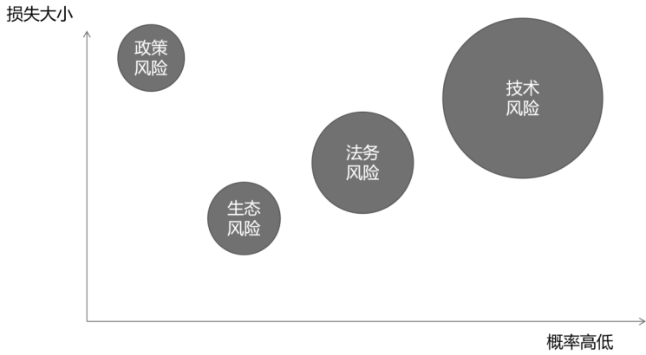

# 第18问 如何理解和防范开源生态风险与开源供应链风险

## 编辑摘要（新增，非原文）

本问围绕“如何理解和防范开源生态风险与开源供应链风险”展开，依次讨论开源生态风险与开源供应链风险的区别；对开源供应链风险的理解；开源供应链的本质；企业内部的开源治理。

## 常见问法（新增检索辅助）

- 如何理解和防范开源生态风险与开源供应链风险？
- 请介绍开源生态风险与开源供应链风险的区别。
- 请介绍对开源供应链风险的理解。
- 请介绍开源供应链的本质。

## 原书正文（转录）

> 保留原书观点与历史案例，未作当前事实更新。正文页码按书内印刷页码；PDF页码从1起，等于书内页码加18。图示保留原图，文字说明标为整理转述。

<!-- source: q018; print_pages: 68; pdf_pages: 86–86 -->

### 18.1 开源生态风险与开源供应链风险的区别

广义来说，开源生态风险最终会导致开源供应链产生风险，因此也属于开源供应链风险的一种。

#### 一、开源软件领域可能遇到的4 类风险

开源软件领域可能遇到4 类风险：技术风险、法务风险、生态风险和政策风险，如图18-1 所示。

**图示文字说明（整理转述）**：图中以损失大小为纵轴、概率高低为横轴，展示政策风险、生态风险、法务风险和技术风险。政策风险偏左上，生态风险偏左下，技术风险位于右上且圆面积最大；图为风险示意，没有给出精确概率或损失金额。

图18-1  开源软件领域可能遇到的4 类风险

在开源软件领域，“技术风险”随时可能冲击项目的运行。代码本身的不完善、隐藏的漏洞或者后门一旦被黑客利用，就可能导致数据泄露或系统瘫痪；而在复杂的依赖链中只要某个上游项目出现漏洞（甚至被人“投毒”），就可能让整个生态陷入危机。正因为技术风险既普遍又波及面广，所以在图18-1 中它的体量最大又偏向关注度的右侧。

<!-- source: q018; print_pages: 68–69; pdf_pages: 86–87 -->

相比之下，“法务风险”虽然看起来没有那么显眼，却同样暗藏危机。开源许可证种类繁多，从GNU 通用公共许可证到Apache 许可证、MIT 许可证，每种许可证背后都有不同的义务和约束。如果在理解不清的情况下把各种许可证混用，或者未与贡献者签署明确的协议，就可能在某个商业化阶段被追究侵权责任。一行未经授权的代码就可能把整个产品拖入漫长的诉讼漩涡，因此在图18-1 中，法务风险紧邻技术风险，提醒我们务必把合规当作常态化管理。

<!-- source: q018; print_pages: 69; pdf_pages: 87–87 -->

再看图18-1 的左下方，“生态风险”显得相对温和，却与项目的生命力息息相关。一个健康的开源社区不仅需要源源不断的新贡献者，也离不开透明的治理和合理的资源分配。一旦项目的核心维护者因精力不足而逐渐淡出，或决策流程不够公开，就容易造成内部摩擦、用户流失，最终使项目在无声无息中走向衰落。生态风险虽然影响范围小于技术风险和法务风险，但决定了项目能否持续发展。

最后，在图18-1 的左上方是“政策风险”─难以预料的风暴。由于地缘政治的影响，国家的政策会不断发生变化，网络安全审查、加密算法出口管制，或者对关键基础软件提出的更高合规要求，都可能瞬间改变开源项目的全球推广策略和开发成本。如果政府补贴导向发生调整，曾经慷慨扶持的资金就可能随之消散【美国政府在2025 年4 月16 日宣布停止资助CVE（Common Vulnerabilities and

Exposures）和CWE（Common Weakness Enumeration）项目，这可能导致开源安全领域的巨大风险】。因此，尽管政策风险发生的概率或许不如代码漏洞那样频繁，但一旦爆发，其影响往往跨越行业与地域，需要项目方持续关注政策动态并灵活应对。

#### 二、应对风险的心态和策略

不同的角色需要担心的风险是不同的，开源项目的作者、一个传统软件的开发者（架构师）、一个公司的CTO/CIO、开源项目办公室的负责人、某一个国家产业政策制定者，他们所处的位置不同，能够选择的应对措施和能够发挥的作用也不一样。以下只能大略提供一些通用的心态与策略。

首先，需要具备常识，理解开源相关的风险是存在的，是可能会带来危害造成损失的。

其次，需要具有判断力，尤其是企业的架构师，在做技术选型的时候需要有所取舍，以规避风险。

再次，需要积极投身开源生态建设，从力所能及的角度出发，为开源生态做一些贡献，降低各种风险的发生概率。

最后，需要做好预案，对那些无法抵御的风险，至少有一个替代的方案，以避免最糟糕的情况发生。

### 18.2 对开源供应链风险的理解

开源软件并非孤立存在，它们相互之间有着依赖关系。当我们思考软件供应链或者开源软件供应链时，会想到一条从不知名的远处延伸到我们面前的链条，这个链条的最后一环是一款我们看得见、用得上的软件。在这个链条中，有很多环节都是别人（别的公司、别的国家）提供的。如果有一天，他们决定拿回自己的那一环，那么延伸到我们面前的链条就断了，我们手中正在使用的软件就不能用了。这就被称为“断供”。

<!-- source: q018; print_pages: 69–70; pdf_pages: 87–88 -->

这样的意象会让我们过度紧张，似乎在一个链条上的任何一个环节都可能是薄弱环节，让我们“受制于人”。在物理世界里，的确会存在零部件断供的现象，所以为了防范风险，我们需要寻找国产替代的零部件。但是在数字世界，尤其是在开源软件的世界，我们需要对供应链有更加符合实际的认知。

<!-- source: q018; print_pages: 70; pdf_pages: 88–88 -->

数字公共产品的复制成本几乎为0，我们需要重新理解什么是开源世界中的“供应”，以及“供应链条”上有哪些风险。

### 18.3 开源供应链的本质

如果我们获得某一款开源软件，开始使用、修改甚至分发，就意味着我们可以在获得授权的前提下，做很多事情，也因此形成了一组合理预期。

- 技术类预期：这款开源软件能够正常工作，不会给我们带来隐患。

- 依赖类预期：这款软件的运行可能还依赖其他开源或不开源的软件、在线服务，这些依赖也应该能够保持正常运行。

- 法务类预期：我们可以通过自行修改软件使这款软件符合我们的需要，还可以（根据许可证）分发修改后的软件，获取商业利润。

- 服务类预期：我们可以在开源社区寻求帮助，也可以购买商业服务，以帮助我们更好地使用这款软件。

只要以上预期被打破，我们就会遇到各种各样的麻烦，也就是“开源供应链风险”。

所以，开源供应链并非源代码本身（仅仅把需要的代码全部下载回来，无法保障供应链安全），而是围绕开源代码的一组合理预期。随着开源生态的日益复杂，本来默认存在且合理的预期，需要被明确地识别出来，并得到相关供应方的承诺。另外，由于难以避免的疏漏，还需要对各种风险有所防范。

### 18.4 企业内部的开源治理

一般开源治理主要是指对外开源的社区与项目治理和企业内部在开源软件使用方面的治理。

在企业的开源软件治理框架中，要确保全流程透明。无论是产品对开源软件的使用，还是对其源代码的修改，都必须有完整、可溯的记录，并通过中心化仓库进行统一管理。这样可以让公司层面对所有开源组件的引入与变更一目了然，为后续的各项管理工作提供坚实基础。

在此基础上，应该建立优选引入的原则，持续从社区中甄选成熟、活跃且质量优良的开源项目，严格对标社区数据与公司质量要求。同时，禁止将已进入衰退期的项目纳入生产环境，并在同一产品版本中尽量统一同一开源软件的版本号，以避免因多版本并存增加漏洞跟踪与修复难度。只有在功能和性能同等的情况下，才推荐采用社区中质量更高的替代品，以此不断提升产品竞争力和整体质量。

<!-- source: q018; print_pages: 70–71; pdf_pages: 88–89 -->

与此同时，所有开源软件的来源都必须可追溯、可信赖。无论是从官方仓库下载还是从企业内部的中心仓下载，均要通过恶意软件扫描、哈希值或数字签名校验，并做到告警清零，杜绝任何潜在的“投毒”风险，以便在客户或监管方询问产品所含组件来源时，能够清晰展示溯源链条，并在漏洞爆发时迅速追踪到受影响的软件实体。

<!-- source: q018; print_pages: 71; pdf_pages: 89–89 -->

在合规义务层面，企业应该坚持在法律法规与开源许可证的双重框架下开展工作。发现漏洞要第一时间向工业和信息化部网络安全威胁和漏洞信息共享平台上报，确保符合法定的漏洞管理要求；在使用和分发过程中，要严格遵守各类开源许可证的声明、分发和开源义务，避免因疏忽而陷入维权诉讼。

为了让治理闭环，不留死角，企业还应该承诺在产品生命周期内实现开源漏洞的“感知、定位、快速响应与通知机制”，从而支撑产品安全，为客户提供稳定可靠的保障。

除了以上关键目标，企业还应该建立“上游优先”的意识，在发现漏洞之后，及时向上游反馈，并协助上游修补漏洞，从而帮助整个开源生态变得更健康。

以下是一些值得关注的企业开源供应链治理实践。

- 2011 年，微软公司发布的《网络供应链风险管理：实现透明和信任的全球共享》报告，提出了一个旨在有效管理供应链风险的框架。该框架具有4 个核心特点：协作、透明、灵活和互惠。

- 2016 年，华为公司发布的《全球网络安全挑战─解决供应链风险，正当其时》白皮书，主张推动多方合作，建立全面的供应链安全管理体系。

- 2020 年，红帽公司提出了《可信软件供应链规范》，旨在为软件安全性、合规性、隐私性和透明性这4 个方面提供保障。

- 2021 年，谷歌公司提出了《软件构建的供应链级别》框架，简称SLSA安全框架，旨在通过端到端的解决方案确保软件供应链的完整性，防止源代码、构建平台或构件仓库被篡改带来的威胁。SLSA 框架定义了4 个安全级别，从SLSA L0 到SLSA L3，每个级别代表不同的安全控制强度和完整性要求。

以上只是企业开源治理框架的简要概述，事实上，要实现这些目标，需要组织、流程、工具与人员能力的多方面保障，第24 问和第30 问会有相关介绍。

## 来源与整理说明

来源：《解码开源：开源生态60问》，庄表伟，第18问；书内第68–71页；PDF第86–89页。
拟定网页路径：`/questions/q018/`（尚未发布）。
摘要、关键词、常见问法与图示说明为新增整理内容；正文与表格保留原稿内容。