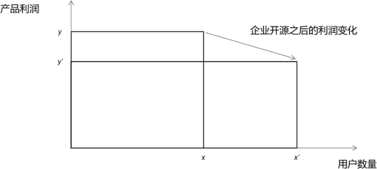
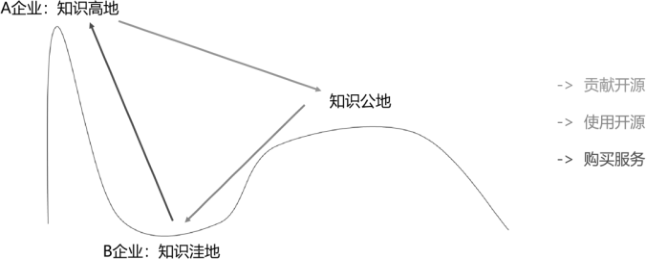

# 第21问 开源商业模式的本质是什么

## 编辑摘要（新增，非原文）

本问围绕“开源商业模式的本质是什么”展开，依次讨论一个简单的开源经济学模型；影响开源商业模式整体利润的因素；一种打击竞争对手的开源商业模式。

## 常见问法（新增检索辅助）

- 开源商业模式的本质是什么？
- 请介绍一个简单的开源经济学模型。
- 请介绍影响开源商业模式整体利润的因素。
- 请介绍一种打击竞争对手的开源商业模式。

## 原书正文（转录）

> 保留原书观点与历史案例，未作当前事实更新。正文页码按书内印刷页码；PDF页码从1起，等于书内页码加18。图示保留原图，文字说明标为整理转述。

<!-- source: q021; print_pages: 81; pdf_pages: 99–99 -->

开源的商业模式多种多样，我们需要更加深入地理解其本质。任何商业都会追求利润，而开源软件背后的企业，自然也希望获取更大的利润。虽然我们看到了企业向社区发布开源项目，似乎意味着利润的丧失，但事实上却可能帮助企业获取更大的利润。

### 21.1 一个简单的开源经济学模型

首先，假设一家企业只销售一款软件，而这款软件的用户数量是x，每一款软件销售的利润是y，那么这家企业的总利润就是x×y。如果企业对外开源自己的产品（或产品的一部分），我们可以猜想：因为开源，这个企业的用户数量会从x 增长到x′ ，而软件的单位产品利润，会从y 下降到y′ 。如果这家企业的开源策略合理，则x y′′×的总面积会大于原来的x×y 的面积，从而实现利润的增长，如图21-1所示。

**图示文字说明（整理转述）**：开源经济学示意图以用户数量为横轴、产品利润为纵轴。企业开源后用户规模从x扩展到x′，单用户对应的利润高度从y降至y′。正文通过比较矩形面积讨论总体利润的变化；图本身不是实测财务数据。

图21-1 开源经济学模型

这背后蕴含以下几个假设。

- 开源之后，企业的知名度、软件的用户数量都会获得增长。

- 软件的定价取决于买家与卖家之间的知识落差，如果一个企业将自己的软件开源，则意味着知识落差减小，从而导致软件的单品利润下降。

<!-- source: q021; print_pages: 82; pdf_pages: 100–100 -->

- 合理的开源商业模式就是，开源导致的利润下降能够被用户数量的大幅增长抵消，甚至帮助企业赚得更多。

再考虑以下两种极端的模式。

- 完全闭源，这当然是传统的、始终合理的商业模式，至今依然有很多企业选择这种模式。

- 完全开源，这是“毫不利己、专门利人”的行为，软件的用户数量可能会非常大，但是基本上赚不到钱。

所以，任何合理的开源商业模式都是在完全闭源与完全开源之间，选择能够使企业整体利润最大化的方案。

企业开源之后的商业生态如图21-2 所示。

**图示文字说明（整理转述）**：图中包含A企业的知识高地、B企业的知识洼地与知识公地，使用箭头表示贡献开源、使用开源和购买服务等互动关系。

图21-2 企业开源之后的商业生态

A 企业通过向知识公地开源自己的软件，进而吸引B 企业的注意力。在简单的使用场景下，B 企业可以直接使用开源软件；在复杂的使用场景下，B 企业知道可以通过向A 企业购买后续服务或其提供的商业版本，从而满足自己的需求。

### 21.2 影响开源商业模式整体利润的因素

#### 一、许可证的选择

一般而言，越宽松的许可证，越是容易获得企业的选择与使用；越严格的许可证（类似GPL、AGPL），越容易导致企业选择时产生更多的顾虑。

但是，越宽松的许可证，也越容易导致开源软件产生更多分支版本（fork），形成更多的竞争对手，从而降低软件的利润。越严格的许可证，越有可能形成紧密协作的技术共同体，从而加快创新速度，从而在与闭源软件的竞争中快速胜出。

#### 二、开放程度与开放策略

软件的开放程度是另一项重要影响因素，具体而言，该因素包括开放代码的范围（仅开放核心部分代码或完整开放全部代码）、代码与相关文档的完整度与细致程度，以及版本发布周期。例如，相对于商业版本的发布周期，开源版本的发布始终落后3～6 个月，这也是一种常见的策略。

<!-- source: q021; print_pages: 82–83; pdf_pages: 100–101 -->

还有一些极端的情况。例如，假开源，其本质也是以最低程度的开放（几乎为0）来换取尽可能多的用户增长。这样的做法一旦曝光，会导致用户与市场口碑的急剧下降，甚至造成公关危机。

<!-- source: q021; print_pages: 83; pdf_pages: 101–101 -->

企业在开源部分软件之后，就会进入一个更复杂的动态竞争状态。竞争对手也同样会使用这部分开源代码，会增强自身产品的竞争力。如何确保企业自己的竞争优势，关键还是要看企业如何吸引并留住高水平的人才，从而能在内部源源不断地创造更新的、更有价值的知识，维持自身的定价权（利润）。

#### 三、社区运营能力

当一个企业选择开源自己的软件，并不意味着它的软件会有更多的人来使用，也不意味着品牌形象会得到提升，更不等同于整体利润会大幅增长。传统的企业都会做客户关系管理（CRM），而在企业开源之后，则需要考虑开发者关系（DevRel）。

与传统的客户关系不同，开发者关系是企业与开发者社区之间建立的深层次关系，它需要企业从技术层面真正走进开发者的世界，理解他们的需求和痛点。成功的开发者关系策略能够将开源项目转化为企业的核心竞争力。

要想更好地运营开源社区，企业需要考虑很多相关的事项，其中最为重要的，就是建立清晰的开源战略（见第28 问），即识别企业的核心竞争力，针对不同的技术领域，选择完全自研、引入开源、回馈社区、主动开源等不同的策略，并在整个企业中贯彻执行。

要想吸引企业之外的开发者，设计良好的贡献机制并建立开发者激励机制非常重要（见第32 问、第35 问、第37 问、第40 问）。实现以上目标，最关键的一点在于：理解开源贡献者的动机与诉求，更进一步则需要理解开源文化，并在自己的企业内部推广开源文化（参见第30 问）。这样才能使企业的开源社区吸引外部人才，留住外部人才。

组织社区活动，建立有效的沟通渠道是保障社区活跃度的长期工作（见第38问、第41 问）。最简单的逻辑就是：有吸引力的社区能够健康生长，这样企业才能事半功倍。

第14 问中已经介绍过开源项目的健康指标，这意味着数据驱动的社区管理是社区运营能力的基本功。以上的全部努力，本质上就是希望能够实现“杠杆效应”。通过优秀的社区运营，使得企业投入的人力物力，能够撬动更多的外部力量自动参与，加入共建。撬动的效果越好，则企业的开源节支就能做得越好。

### 21.3 一种打击竞争对手的开源商业模式

前面讨论的开源商业模式，都是“正面进攻”，但是商战中的招数还有更多侧面的玩法。按照前面的分析，企业对外开源，意味着降低了某一个部分的知识落差，从而导致利润减少。但是，如果企业开源的项目，并不是自己的优势技术，而是竞争对手的优势技术呢？这样就能够有效地减少竞争对手的利润空间，从而拓展自身市场。

比较典型的案例就是IBM 公司在Linux 操作系统领域的大量投入，一方面能够打击微软的Windows 操作系统，另一方面也能促进自身的服务器销售，可谓一举两得。

<!-- source: q021; print_pages: 84; pdf_pages: 102–102 -->

另一类常见的打击竞争对手的做法出现在多家企业基于开源项目的竞合生态中。有多家企业都围绕同一个开源项目，开发自己的商业化的版本，但同时又贡献一部分代码到开源项目之中。这时，生态企业的选择往往并不贡献自己有技术竞争力的那部分代码模块，而是贡献同一生态中其他企业较有竞争力的模块。虽然自己的这部分技术并不是最好的，但至少也是某种开源贡献（对外提升品牌），还能够“卷”竞争对手，迫使对方加大开源力度。当然，对方也不会坐以待毙，而是选择开源己方更加擅长的技术领域，大家就都“卷起来”了。

以上的开源生态，通过开放式的竞争迫使对手也变得更开放，对整个市场确实是整体利好的事情，大家也都喜闻乐见。

## 来源与整理说明

来源：《解码开源：开源生态60问》，庄表伟，第21问；书内第81–84页；PDF第99–102页。
拟定网页路径：`/questions/q021/`（尚未发布）。
摘要、关键词、常见问法与图示说明为新增整理内容；正文与表格保留原稿内容。