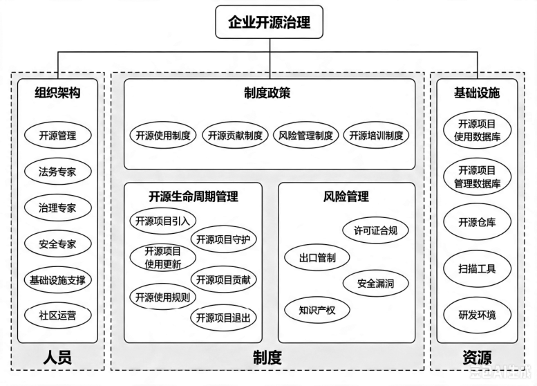
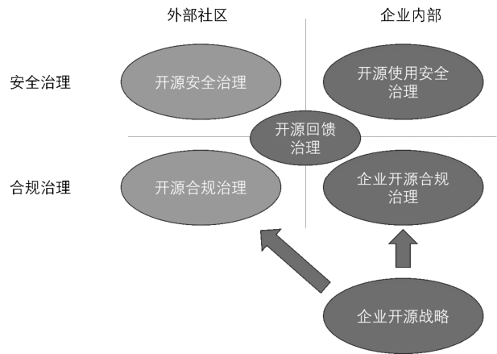

# 第23问 如何建立企业开源合规治理框架

## 编辑摘要（新增，非原文）

本问围绕“如何建立企业开源合规治理框架”展开，依次讨论企业开源面临的合规性挑战；企业开源合规治理框架。

## 常见问法（新增检索辅助）

- 如何建立企业开源合规治理框架？
- 请介绍企业开源面临的合规性挑战。
- 请介绍企业开源合规治理框架。

## 原书正文（转录）

> 保留原书观点与历史案例，未作当前事实更新。正文页码按书内印刷页码；PDF页码从1起，等于书内页码加18。图示保留原图，文字说明标为整理转述。

<!-- source: q023; print_pages: 86; pdf_pages: 104–104 -->

开源软件的合规性管理，主要涉及在使用、分发和管理开源软件时，遵循相关法律法规及其许可协议的过程。这里主要讨论从企业视角出发的开源合规管理，根据开源合规的场景划分，可以分为使用开源、回馈开源和对外开源3 类。按照T/CESA 1270.2—2023《信息技术 开源治理 第2 部分：企业治理评估模型》，企业的开源治理又可以分为组织、制度和基础设施3 个方面。

### 23.1 企业开源面临的合规性挑战

总体来说，合规就是：确保做了该做的事情，保证不做不该做的事情。而哪些事情该做，哪些事情不该做，则主要依据各国的法律法规，以及各个不同的许可证中的规定。而企业要做的事情粗略地划分有两件：一是明确自己的合规义务，二是确保能够遵循合规义务。但说起来简单的事情，做起来却往往异常困难。

#### 一、企业使用开源的合规性挑战

企业使用开源的情况，还可以分为两大类：一类是完全在企业内部使用（自用），另一类是企业在对外销售的软硬件或提供的在线服务中用到了开源（商用）。一般来说，自用的合规风险比较低，大多数合规挑战还是来源于开源（商用）。但是，由于我们很难排除原本自用的软件，考虑商用销售的可能性，因此企业的开源使用治理，最好一开始就尽量掌握自用情况。

另一个使用开源中常见的误区，就是“以为能够下载到源代码的就是开源”。事实上，必须对企业内部的软件开发人员进行最基本的开源培训之一就是不要下载没有许可证的软件，更不要在企业内部使用，这是一条必须明确的红线。没有授权的源代码，就只是给你看的，不是给你“拿来用的”。

还有一种开发过程中的陋习，企业必须严厉禁止，就是代码的“片段引用”。未经培训的开发者可能会在网络上随意下载开源代码，直接将别人代码中的一部分复制到自己的项目中，这样通常会造成合规问题，可能会给企业带来很多麻烦。

<!-- source: q023; print_pages: 86–87; pdf_pages: 104–105 -->

如果开源软件本身带有许可证，那也需要看清楚到底是什么许可证。因为这意味着后续企业需要考虑不同程度的合规义务，而合规义务是否繁重则与企业的研发成本息息相关。如果引入了类似于GPL 的开源软件，导致企业最后必须开源自己的机密代码（以满足合规要求），则可能给企业带来知识产权方面的重大损失。

<!-- source: q023; print_pages: 87; pdf_pages: 105–105 -->

更加复杂的情况是，软件依赖导致的“许可证丛林”。明明只引入了一个开源软件，但这个开源软件却层层依赖了其他一堆开源软件（组件），而这些开源软件又各自选择了不同的许可证。最糟糕的情况是，这些许可证还存在兼容性问题，不能一起使用。最开始被引入的开源软件的作者可能未在意，但企业在使用，尤其是商用时，必须格外谨慎。

另外一种比较容易忽略的情况是，企业采购了商业软件，但该商业软件本身包含开源软件。从提供商业软件的企业角度来说，有义务提交完整的开源软件使用说明，并证明自己已经尽到了开源合规义务。否则，乙方的不负责任可能会给甲方带来风险。

#### 二、企业回馈开源的合规性挑战

企业在内部使用开源软件的过程中，可能会自行修改以符合自己的需要。是否需要将这些修改回馈到开源社区，则是一个需要考虑的问题。企业在面对这个问题时，主要应根据以下方面进行考虑。

从法律与合规的维度考虑，某些许可证（如GPL、AGPL）明确要求发布修改后的衍生作品必须在同等条件下开源；其他许可证（如MIT 许可证、Apache-2.0许可证）则仅建议保留声明，回馈与否更多取决于企业策略。修改开源软件时加入的代码，可能涉及第三方专利或内部专利，一旦回馈到社区，就可能无意中放弃对某些专利的追索权，所以应该慎重考虑。

从业务与战略的维度考虑，则需要在企业技术竞争力与企业技术品牌形象之间，做出艰难的权衡。

从技术与运维的成本考虑，则是一个复杂却重要的判断：到底是在内部始终维护一个自己的分支，定时合并来自外部最新版本的代码，还是组织一个内部的维护团队，密切地与外部社区合作，不断提交回馈代码？哪一种的长期成本更低？

虽然这里主要聚焦于合规问题，但企业的思考路径应该是：首先从合规视角判断是否必须回馈社区，其次是从业务战略与技术运维的成本视角，判断是否有必要回馈社区，最后是如果决定回馈社区，还有哪些需要面对的合规性挑战。

一旦企业决定回馈开源社区，则需要考虑两个问题：一是完善贡献流程，如果缺乏标准化的贡献准入流程，开发者直接向社区提交代码，可能泄露企业敏感信息或违反公司政策；二是明确知识产权归属，在回馈代码前，需明确员工贡献代码的知识产权归属，否则可能引发著作权争议。

#### 三、企业主动开源的合规性挑战

企业开源希望能够换来更大的商业利益，这在第21 问已有论述。而开源对于企业的挑战就在于：尚未看到利益的增长，损失却已经实实在在地发生了。

首先，企业肯定不希望发生“原本不想开源的代码泄露出去”这样的悲剧。所以由此而来的挑战在于：如何制定内部规则，确保不该开源的代码，不会被开源。要通过制度与工具，确保这样的规则能够被妥善执行。还有相关的知识产权审查，需要确保开源的代码所关联的专利、商标等知识产权，被合理声明或已经受到妥善的保护。

<!-- source: q023; print_pages: 88; pdf_pages: 106–106 -->

其次，开源之后，因许可证问题带来的各种麻烦：包括选择了不合适的许可证，导致企业的利益受损；在开源的代码中包含了其他第三方代码，从而引入了更多的第三方授权冲突；修改了第三方代码后应遵循的合规义务，由于开源后暴露在公众视野，甚至会带来公关危机。

最后，开源合规是一个长期持续的工作，需要针对后续不断提交的代码，进行代码审计、许可证审核、安全扫描。若无专业人员与自动化工具支持，成本和周期难以控制。企业如果没有一个合理的成本预算，可能会在随后遇到的麻烦面前束手无策。

### 23.2 企业开源合规治理框架

按照《信息技术 开源治理 第2 部分：企业治理评估模型》的描述，企业应从组织架构、制度政策、基础设施三方面构建合规体系，如图 23-1 所示。相关的论述建议参考盈科律师事务所编写的《开源软件合规与法律指南》一书。另外，中伦律师事务所发布的“开源合规白皮书”和OSPO 联盟（OSPO Alliance）发布的“开源治理良策”也值得参考。在第18 问介绍了企业内部的开源治理，企业开源治理涉及的范畴如图 23-2 所示。本节主要讨论企业内部的合规治理工作，但是采取安全措施、回馈社区的做法，甚至包括整个开源战略，在组织架构、规章政策、基础设施等方面也可以复用一大部分。

**图示文字说明（整理转述）**：企业开源治理评估模型分为组织架构、制度政策、基础设施，对应人员、制度、资源。组织架构包括开源管理、法务、治理、安全、基础设施支持和社区运营；制度覆盖使用、贡献、风险管理、培训与开源全生命周期；基础设施包括项目数据库、仓库、扫描工具和研发环境。

图23-1 企业开源治理评估模型（引用自《信息技术 开源治理 第2 部分：

企业治理评估模型》）

<!-- source: q023; print_pages: 89; pdf_pages: 107–107 -->

**图示文字说明（整理转述）**：图中从外部社区与企业内部、安全治理与合规治理两个维度，区分开源安全治理、开源使用安全治理、开源合规治理和企业开源合规治理。开源回馈治理位于交界处，企业开源战略位于底部并支撑相关治理。

图23-2 企业开源治理涉及的范畴

#### 一、组织架构与人员能力

首先需要明确的是，企业内部的开源治理是一个需要跨部门协作才能完成的复杂任务，这样的组织现在往往会被称为开源项目办公室（Open Source Program

Office，OSPO）。但是，在企业投入开源治理的早期，往往会从各种不同的角度来培养开源治理的综合能力。因此，有些开源项目办公室是从企业的法务部生长出来的，有些是从企业的安全部门生长出来的，还有些是从企业的研发工程与效能团队生长出来的。最开始，这可能还只是一个虚拟团队，小组的成员本身有自己所在部门的各种本职工作，直到企业深刻意识到开源治理的重要性，才会逐步推动这样的组织实体化。（如何在企业内部建立开源项目办公室详见第30 问。）

#### 二、规章制度与管理框架

在制定明确的规章制度与管理框架之前，首先需要明确的是治理的目标。

在开源软件治理中，过程透明是第一要务。企业应该致力于建立完整的开源软件使用与修改记录系统，通过中心仓库实现透明管理，确保所有开源组件在公司层面可视可控。这不仅作为各项管理活动的基础，也使团队能够全面掌握产品中的开源成分。

优选引入机制确保企业能够持续吸纳高质量的开源软件。通过对标社区数据，严格筛选符合公司质量标准的组件，支持产品履行开源义务并有效应对漏洞。同时，企业也应限制使用衰退期软件，推动版本归一化管理，降低维护成本，并积极推荐更优质的替代方案，从而增强产品竞争力。

来源可信是企业软件的核心安全保障。应该确保每一个开源组件都能追溯至对应社区，并通过恶意软件扫描与哈希值/签名校验实现无告警。这不仅帮助产品在客户面前证明软件成分的纯净性，还建立了坚实的防御机制，抵御潜在的软件供应链攻击，保护产品免受恶意代码侵害。

<!-- source: q023; print_pages: 89–90; pdf_pages: 107–108 -->

合法合规应该是企业的基本原则，遵循国家及地区法律法规，履行开源许可证规定的各项义务，包括使用声明和代码开源义务，有效规避因违反开源协议可能带来的法律风险。

<!-- source: q023; print_pages: 90; pdf_pages: 108–108 -->

这里也附带提及一些开源安全治理的目标：漏洞感知与修复确保产品全生命周期的安全性。应该建立高效的漏洞响应机制，实现小时级感知、分钟级定位，并按照服务水平目标完成修复。这一体系确保企业能够迅速应对新出现的安全威胁，满足客户对产品安全性的期望，同时维护产品在市场中的可靠声誉。

在明确了开源治理的目标之后，企业还应该建立一套术语库（以统一企业内部的各种术语）和各种规则制度。

（1）管理规范。管理规范是开源治理的基础性文件，定义了组织如何管理开源软件的总体原则和要求。“开源软件管理规定”建立全局治理框架，“开源软件选型规范”确保引入高质量组件，“使用与维护规范”规范日常操作，“生命周期管理规则”确保全周期管控，“安全与漏洞管理规则”保障安全响应，而“开源所有者职责分工”明确各角色责任。这些规范共同构成了开源治理的政策基础。

（2）流程文档。流程文档将管理规范具体化为可执行的工作流程。“开源软件选型与引入流程”指导如何评估和引入新组件，“开源软件维护流程”确保组件得到持续更新和支持，“开源软件社区回馈流程”规范组织如何回馈开源社区。这3个流程文档涵盖开源软件从引入到回馈的完整生命周期，确保各环节有章可循。

（3）工程规范。工程规范提供了技术层面的具体要求，确保开源治理能够落地实施。“开源中心仓技术规范”和“开源制品工程规范”确保组件存储和使用的标准化，“开源定制修改相关命名规范”保证修改的可追溯性，“门禁服务规则与规范”建立质量控制机制，“开源软件数据定义及质量要求”设定质量基准。这些规范使开源治理从理念转变为可实施的工程实践。

（4）操作指导。操作指导为具体实施人员提供详细指引。“操作全景图与流程指导”提供整体视图，“开源软件分类与质量策略指导”帮助实施差异化管理，“对外开源自检流程指导”确保合规性，“开源软件漏洞与风险评估指导”支持安全管控。这些指导文档使治理要求变得可操作，确保一线人员能够准确理解和执行各项规定。

这套完整的开源治理规章制度体系，从政策到实施，从管理到技术，形成了一个闭环的治理框架。通过这些文档的系统实施，组织可以实现开源软件的透明管理、优质引入、来源可信、合法合规及高效的漏洞管理，从而提升产品质量，降低安全与法律风险。

#### 三、基础设施与IT 工具

企业级的开源治理需要企业级的基础设施与IT 工具，这对企业的研发工程管理提出了更高要求。我们需要理解研发工具的集成化、开放平台化与数字化的发展趋势，这些趋势正在重塑企业开源治理的实践。

<!-- source: q023; print_pages: 90–91; pdf_pages: 108–109 -->

（1）集成化趋势体现为工具链的无缝衔接和功能整合。现代开源治理工具不再是孤立的点状解决方案，而是相互连接的生态系统。通过建立公司级的代码托管平台、构建与部署平台以及开源及第三方资产管理平台，实现端到端的组件分析、漏洞监测，再到合规检查，各工具间实现数据共享与流程联动。这种集成使开源组件的全生命周期管理成为可能，企业能够从引入、使用到维护、更新，形成完整的可视化管理链条，大幅提高治理效率并减少人为错误。

<!-- source: q023; print_pages: 91; pdf_pages: 109–109 -->

（2）开放平台化代表了工具架构的根本转变。企业级开源治理平台正从封闭的专有系统向开放、可扩展的生态转型。这类平台提供核心功能和API，允许企业根据自身需求定制和扩展功能，同时与现有的DevOps 工具链无缝集成。开放平台能够更好地适应不同企业的治理模式，也便于引入第三方专业工具，如OSS Review

Toolkit、FOSSA 或Black Duck 等，构建最适合企业的组合式解决方案。

（3）数字化则是开源治理进入数据驱动时代的标志。通过资产数字化与数字资产化，借助自动化扫描、机器学习和大数据分析，企业能够实时监测开源组件的健康状况、使用情况和潜在风险。数字化工具可以自动识别产品中的开源组件、追踪其版本和许可证，甚至预测可能出现的安全漏洞。这种基于数据的治理方式使决策更加精准，响应更加迅速，特别是在漏洞管理方面，实现了“小时级感知，分钟级定位”的目标。有了数据，才有智能化的可能，但由于数字化本身的进展缓慢，智能化也只能局限于非常有限的范围之内，其余的可能性只能作为美好想象的题材。

企业级的研发工具整体架构如图23-3 所示。

**图示文字说明（整理转述）**：企业级研发工具架构图包括数据服务层（数据、算法、能力）、技术解决方案（界面整合、业务串连）与业务管控层（规则、权限、流程），底部DevOps层贯穿设计、开发、编译、扫描、测试、发布和部署。

图23-3 企业级的研发工具整体架构

企业在加强研发工程管理的过程中，应该特别关注工具与流程的协同优化。最佳的开源治理不仅仅是部署先进工具，还包括将工具融入研发流程，使开源治理成为开发团队日常工作的自然延伸，而非额外负担。只有技术和流程双管齐下，企业才能建立真正有效的开源治理体系，在保障安全和合规的同时，充分发挥开源软件的创新价值。

企业内部的开源治理是一个涉及人员、规章制度与IT 工具，跨越多个不同知识领域的复杂系统工程。要建立合格的开源治理框架，需要企业投入持续不懈的努力。如果企业不能深刻认识到开源为企业创造的价值，是很难坚持投入的。如果企业内部的OSPO 人员陷入烦琐且徒劳的自我证明（对企业的价值），则可能难以持续有效地开展工作。

## 来源与整理说明

来源：《解码开源：开源生态60问》，庄表伟，第23问；书内第86–91页；PDF第104–109页。
拟定网页路径：`/questions/q023/`（尚未发布）。
摘要、关键词、常见问法与图示说明为新增整理内容；正文与表格保留原稿内容。