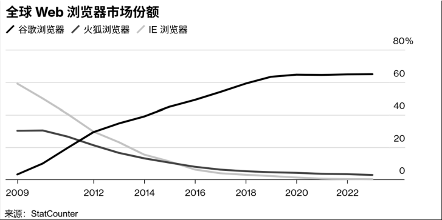

# 第24问 开源商业化有哪些成功的案例

## 编辑摘要（新增，非原文）

本问围绕“开源商业化有哪些成功的案例”展开，依次讨论如何选择开源商业化的成功案例；红帽：开源商业化的范式革新；谷歌：开源生态的流量霸权；PingCAP：开源数据库的全球化突围等内容。

## 常见问法（新增检索辅助）

- 开源商业化有哪些成功的案例？
- 请介绍如何选择开源商业化的成功案例。
- 请介绍红帽：开源商业化的范式革新。
- 请介绍谷歌：开源生态的流量霸权。

## 原书正文（转录）

> 保留原书观点与历史案例，未作当前事实更新。正文页码按书内印刷页码；PDF页码从1起，等于书内页码加18。图示保留原图，文字说明标为整理转述。

<!-- source: q024; print_pages: 91; pdf_pages: 109–109 -->

### 24.1 如何选择开源商业化的成功案例

<!-- source: q024; print_pages: 91–92; pdf_pages: 109–110 -->

在开始案例分析之前，需要回答的问题是如何选择案例？开源项目、开源企业或者大型企业的开源战略，都是值得分析的案例素材。我们需要区分项目级案例与企业级案例。虽然开源项目的案例研究也非常重要，但是从商业化的角度来看，还是以企业为单位进行研究更加有价值。因为开源商业化的本质是企业战略行为，需要分析公司层面的资源整合、生态构建与盈利闭环。项目级案例虽能反映技术成功与社区成功，但难以体现市场验证、规模化变现和可持续发展能力。

<!-- source: q024; print_pages: 92; pdf_pages: 110–110 -->

另一个选择的难题是“如何衡量是否成功”。毕竟成功的开源项目、开源社区、开源战略与（基于开源的）商业收益，都有不同的衡量标准，也需要不同的定义。如果从最初的目标出发，我们应该研究的是：达成企业最初商业目标的开源战略与相关执行情况。但是这样的案例太难筛选了。一方面是缺乏资料，企业最初有没有明确的商业目标，可能并未披露，也可能他们当初都没有想清楚；另一方面是难以判断，企业内部对于其开源战略成功与否的总结可能与外部的评价都不一致。

一个选项来自《2024 中国开源年度报告》中的全球企业排行榜，排名前10 的企业是微软、华为、谷歌、亚马逊、Meta、红帽、Mozilla、阿里巴巴、Elastic 和IBM。笔者最终选择美国的两个案例─红帽和谷歌，以及中国的两个案例─PingCAP 和华为，如表24-1 所示。之所以这样选择，一是因为10 家企业实在太多，二是因为希望平衡介绍中美两国的成功案例。当然，OpenRank 指标的排序是否能够代表企业的商业成功也很值得商榷。

表24-1 开源商业化成功案例与选择理由

| 地域 | 案例 | 选择理由 | 特征 |
| --- | --- | --- | --- |
| 美国 | 红帽 | 订阅模式鼻祖，完整开源商业化闭环 | 以开源为核心业务的企业 |
| 美国 | 谷歌 | 开源生态构建者，广告+云服务多元变现 | 大企业执行开源战略的代表 |
| 中国 | PingCAP | 开源数据库全球化标杆，社区驱动型商业化 | 以开源为核心业务的企业 |
| 中国 | 华为 | 从封闭到开源的战略转型代表 | 大企业执行开源战略的代表 |

### 24.2 红帽：开源商业化的范式革新

红帽是全球领先的企业级开源解决方案供应商，成立于1993 年，总部位于美国北卡罗来纳州罗利市。作为标准普尔500 指数成员，公司拥有超过2 万名员工和100 多家分公司，覆盖全球市场。其核心业务涵盖操作系统（RHEL）、云计算（OpenShift）、存储（Ceph Storage）、中间件（JBoss）和自动化工具（Ansible）等领域。2018 年，IBM 以340 亿美元收购红帽，进一步强化了其在混合云和开源生态中的战略地位。

<!-- source: q024; print_pages: 92–93; pdf_pages: 110–111 -->

作为开源商业化领域的“教科书式”案例，红帽开创了“开源产品+订阅服务”的商业模式范式。自1993 年成立以来，该公司通过提供企业级支持、安全补丁和系统维护服务，将免费的开源技术转化为付费的商业产品。这一模式成功解决了企业用户在生产环境中使用开源软件的后顾之忧。红帽在2019 年经营性现金流为10.1 亿美元，递延收入占比显著，反映出订阅模式的稳定性。从收入的整体结构来看，订阅服务收入占据主导地位（2019 财年占比87.7%），其次是咨询与培训（12.3%）。2019 财年营收33.62 亿美元，同比增长15.1%，毛利率稳定在85%。

<!-- source: q024; print_pages: 93; pdf_pages: 111–111 -->

红帽的商业模式以“开源社区+企业服务”为核心，形成差异化竞争力。

- 免费软件，付费服务：软件代码开源免费，收入依赖订阅制技术支持。例如，RHEL 用户需订阅以获得安全更新、兼容性认证和7×24 小时支持。

- 技术整合路径：通过“项目—集成—平台”3 个阶段，将社区创新（如Linux 内核、Kubernetes）转化为企业级产品。例如，OpenShift 整合容器、自动化和云原生技术。

- 混合云定位：成为企业私有云与公有云之间的连接桥梁。

- 生态中立性：保持与多云计算提供商的兼容性，避免被厂商锁定。

红帽的成功表明，开源并非反商业，而是构建了新的价值创造逻辑。其模式精髓在于找准了企业用户的痛点─生产环境中的稳定性与安全性需求，并通过专业服务满足这些需求。这一范式为后续开源企业的商业化提供了基础参考框架。

### 24.3 谷歌：开源生态的流量霸权

谷歌是全球领先的科技公司，成立于1998 年，总部位于美国加利福尼亚州山景城。公司拥有超18 万名员工，业务覆盖全球150 多个国家。其核心业务涵盖搜索引擎（Google Search）、云计算（Google Cloud）、开源操作系统项目（AOSP）、浏览器（Chrome）、AI 框架（TensorFlow）及大模型（Gemma）等领域。其中，AOSP、Kubernetes、Chrome、TensorFlow 等项目，都是谷歌旗下全球著名的开源项目。

从商业战略的角度来说，Android 是谷歌最成功的开源品牌。AOSP（Android

Open Source Project）才是真正的开源项目，Android 并不能称之为开源项目。但是，在普通人的心目中，Android 就是开源的代名词。事实上，谷歌成功实现了一套“开放核心+闭源服务”的商业模式，一方面通过开源，免费授权设备厂商，快速地拓展市场，抢占原本属于iOS 的市场份额。另一方面又通过GMS（Google

Mobile Service），提供闭源增值服务，牢牢把控生态位，赚取预装授权费+广告分成。据报道，2016 年，Android 为谷歌带来了310 亿美元的年收入，其中220 亿美元为净利润。

在浏览器领域，谷歌从2005 年开始，通过支持Mozilla Firefox 开源，每年支付Mozilla 约4 亿至4.5 亿美元，以确保谷歌作为Firefox 的默认搜索引擎，从而实现流量闭环。但是，谷歌最终决定自行开发一款浏览器（Chrome），随后逐步赶上并超过了Firefox 的市场份额，成为浏览器领域的最后赢家（见图24-1）。这背后的逻辑依然是流量与广告收入。

<!-- source: q024; print_pages: 94; pdf_pages: 112–112 -->

**图示文字说明（整理转述）**：图中比较2009年以后谷歌、火狐和IE浏览器的全球Web市场份额：谷歌曲线明显上升并居于高位，火狐和IE总体下降。来源为StatCounter；图中曲线不等于当前市场数据。

图24-1 浏览器市场占有率变化（来源：StatCounter）

在云计算领域，谷歌开源的项目同样出色，但是却未能获得类似于操作系统或浏览器那样的成功。根据Gartner 数据，2019 年谷歌云的全球市场份额仅为5.3%，而AWS 和Azure 分别为45%和17.9%，即使到了2025 年，谷歌云的市场份额也仅为10%～12%，其中的原因也相当耐人寻味。有相当多的分析指出：谷歌的工程师文化主导，忽视企业需求痛点；ToB 服务能力结构性缺失是最主要的原因。另外，关键收购错失（GitHub、红帽分别被微软和IBM 收购），渠道建设滞后也是关键的原因。

总之，企业选择开源战略，并不能够确保必然获得成功，即使是谷歌这样深谙开源、擅长开源模式的大厂。

### 24.4 PingCAP：开源数据库的全球化突围

PingCAP（平凯星辰）成立于2015 年，是全球领先的企业级开源分布式数据库厂商。其使命是通过技术赋能开发者和企业，推动数据价值的最大化与数字化转型。产品体系以TiDB 为核心，覆盖OLTP（在线事务处理）、OLAP（在线分析处理）及HTAP（混合事务/分析处理）场景，支持云原生部署和MySQL 兼容生态。在全球9 个分支机构（中国、美国、日本等），服务20 多个国家的3000 多家企业，包括金融（中国银行、平安人寿）、互联网（京东、小米）、Web3（NFTScan）等关键领域。

与红帽的服务订阅模式不同，PingCAP 探索出了“开源核心+云服务+生态增值”的复合商业模式。2023 年营收3500 万美元（同比增长94.4%），中国市场增速100%。海外市场收入占比超50%，成为中国开源软件领域营收最高的企业。2024 年估值达30 亿美元，成为中国最大的开源独角兽企业。

<!-- source: q024; print_pages: 94–95; pdf_pages: 112–113 -->

PingCAP 的成功首先建立在强大的开源社区运营基础上。截至2024 年底，TiDB 在GitHub 上获得超过38000 个星，汇聚全球近900 名代码贡献者。这种社区驱动的开发模式不仅加速了产品迭代，也形成了天然的客户教育渠道。PingCAP的联合创始人兼CTO 黄东旭将开源社区视为“最佳获客引擎”─技术团队通过社区讨论即可了解用户需求，而产品优劣也在开发者群体中形成口碑传播，大幅降低了传统企业软件销售的高昂获客成本。

<!-- source: q024; print_pages: 95; pdf_pages: 113–113 -->

PingCAP 的另一个战略亮点是国际化与本土市场的双轨并行。公司早期以中国互联网企业为目标客户，如游戏公司盖娅互娱成为其首家付费客户。这些互联网业务场景具有高并发、数据量大的特点，为TiDB 提供了极佳的产品打磨机会。随着产品成熟，PingCAP 迅速拓展海外市场，目前已在美、欧、日、南亚等地区建立客户群，海外营收甚至超过国内。

PingCAP 通过“开源驱动创新、订阅保障营收、云服务扩展市场”的模式，成功在分布式数据库领域占据一席之地。其核心护城河在于技术领先性与社区生态的正向循环，而未来挑战则集中在全球化市场的深度渗透与传统行业的替代竞争中。

PingCAP 的案例证明，开源是全球基础软件领域最有效的市场进入策略。通过社区驱动的产品迭代和全球化的协作网络，中国开源企业完全有能力在数据库等核心基础软件领域实现技术突破，并将本土创新转化为全球竞争力。其“产品—社区—商业化”的正向循环模型，为新一代开源企业提供了可复制的增长框架。

### 24.5 华为：从封闭到开放的生态转型

华为公司成立于1987 年，但是长期以来却非常重视“信息安全”，特别重视内部的知识产权和源代码保护，以防外泄。对于开源的看法与投入，也偏于保守。直到2008 年，华为才成立了开源能力中心，致力于规范开源软件的使用和管理。根据华为首席开源联络官任旭东所著的《开源心法》介绍，华为的开源可以分为4 个发展阶段。

- 2009 年之前：专注于开源软件的规范使用，实现从自发到有序的转变。在合规使用的基础上，更关注开源软件的安全性问题。

- 2010～2014 年：以2010 年加入Linux 基金会为标志，积极参与开源社区，构建开源战略管理体系。先后加入了Apache 软件基金会、OpenStack基金会、Linaro 基金会等重要组织，并于2014 年正式建立了公司级的开源战略管理体系。

- 2015～2017 年：持续深化开源贡献、构建对外开源管理体系及团队，积极探索主动开源。2015 年，华为作为初创成员参与了CNCF 的成立；2016 年，华为还主动开源了LiteOS，并在随后的时间里，不断发起和捐赠了更多的开源项目。

- 2018 年至今：坚持积极贡献，不断优化开源机制，加速重量级开源项目孵化。

除了企业主动从封闭向开放的转变，来自美国的极限施压，也是促使华为变得更加积极拥抱开源的推动因素。

<!-- source: q024; print_pages: 95–96; pdf_pages: 113–114 -->

美国对华为制裁的时间如下：2018 年6 月7 日，美国国会呼吁谷歌停止与华为合作。2019 年5 月15 日，时任美国总统特朗普发布总统令，主要内容为禁止使用敌对国家（Adversary）的信息与通信技术及服务，并授权美国商务部具体执行。同日，美国商务部及其下属机关“工业与安全局”（BIS）公布执行总统令的具体措施，将华为加入“实体清单”（Entity List）。2019 年5 月19 日，谷歌公司将华为手机从安卓升级列表中删除。同日，谷歌宣布暂停向华为提供GMS，包括Google Play 商店、Gmail、Google 地图等应用程序和服务。2019 年7 月16 日，美国两党参议员组织推出了5G 立法，该立法将华为列入黑名单。

<!-- source: q024; print_pages: 96; pdf_pages: 114–114 -->

于是，到了2019 年8 月，在华为开发者大会上，华为正式发布了鸿蒙系统HarmonyOS。更进一步，2020 年6 月15 日，在多方共同努力之下，由阿里巴巴、百度、华为、浪潮、360、腾讯、招商银行联合发起，开放原子开源基金会在民政部注册成立，成为中国首个致力于开源产业公益事业的非营利性独立法人机构。同年9 月10 日，华为OpenHarmony 操作系统开源，并捐赠到开放原子开源基金会。随后开始的，是一段令人惊叹的飞速发展。截至2025 年1 月31 日，社区累计超过8200名贡献者，代码量1.3 亿行，生态伙伴发展至401 家，共63 家成员单位。社区通过技术创新和生态建设，推动了全场景操作系统的构建，覆盖金融、教育、医疗、交通、工业等多个关键行业。2025 年5 月8 日，鸿蒙计算机也正式亮相，预约开始约15 个小时，华为商城中MateBook Fold 非凡大师的预约人数就超过了5 万人。

另一个著名的华为开源项目是openEuler，openEuler 前身为华为于2010 年启动的内部研发项目EulerOS 操作系统，主要用于服务器、存储等ICT 产品。2019年12 月31 日，华为将EulerOS 项目开源，并重新命名为openEuler，这标志着一个面向多样性计算的全新开源社区的诞生。2021 年11 月，华为将openEuler 捐赠到开放原子开源基金会，进入产业共建阶段。如今，openEuler 已经成为全球最具活力的操作系统开源社区之一。到2024 年12 月，openEuler 的累计装机量突破1000 万套，市场份额达36.8%（中国服务器市场），根据最新的（2025 年7 月）统计数据：openEuler 的用户达到415 万个、贡献者2.2 万名、单位成员2073 家。

针对华为的开源商业案例，我们可以总结如下：务实的经营理念推动华为从封闭走向开放，坚定的战略执行为华为带来了丰硕的开源生态成果。

## 来源与整理说明

来源：《解码开源：开源生态60问》，庄表伟，第24问；书内第91–96页；PDF第109–114页。
拟定网页路径：`/questions/q024/`（尚未发布）。
摘要、关键词、常见问法与图示说明为新增整理内容；正文与表格保留原稿内容。