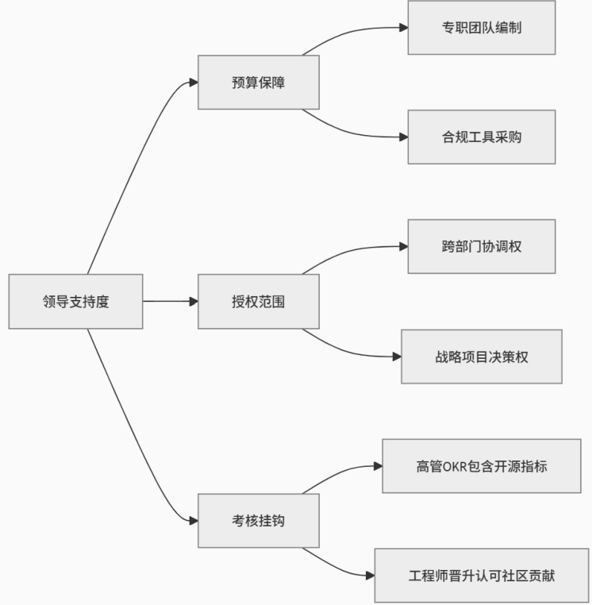

# 第30问 如何在企业中建立开源项目办公室

## 编辑摘要（新增，非原文）

本问围绕“如何在企业中建立开源项目办公室”展开，依次讨论开源项目办公室的定义；开源项目办公室的价值；开源项目办公室的成长路径；开始前的准备工作等内容。

## 常见问法（新增检索辅助）

- 如何在企业中建立开源项目办公室？
- 请介绍开源项目办公室的定义。
- 请介绍开源项目办公室的价值。
- 请介绍开源项目办公室的成长路径。

## 原书正文（转录）

> 保留原书观点与历史案例，未作当前事实更新。正文页码按书内印刷页码；PDF页码从1起，等于书内页码加18。图示保留原图，文字说明标为整理转述。

<!-- source: q030; print_pages: 109; pdf_pages: 127–127 -->

在本书的第23 问、第26 问和第28 问，都提到了组建开源项目办公室的问题。无论是开源治理、开源战略的制定与执行，还是在企业中推广开源文化，都需要通过开源项目办公室来落实。那么，如何才能成功地建立起一个开源项目办公室呢？在第23 问中，我们谈到了开源项目办公室的人员构成，需要哪些类型的专家与角色。但是，仅仅把这些人找出来并放到一起，是不够的。我们还得从头说起。

### 30.1 开源项目办公室的定义

开源项目办公室是一个组织的开源运营与开源架构中的能力中心。它负责定义、实施和指导这些工作的战略和政策。这可能包括围绕代码使用、分发、选择、审计、贡献和其他关键领域制定政策；为参与开源活动的人员（组织内部和外部）提供教育和培训；通过鼓励可持续地使用现有开源组件，并在适当的情况下将增强功能贡献回这些项目，支持组织提高软件开发效率；在需要时，指导团队将其软件开源；确保工程效率、法律合规性；促进和建立社区参与。内源与开源密切相关，经常与开源项目办公室合作或成为其一部分。

对外，开源项目办公室是企业与开放源码社区之间的重要桥梁，有助于确保企业成为开放源码软件的良好管理者，并从采用开放源码软件中获益，同时将风险降至最低。对于组织内部而言，开源项目办公室是整个组织内开放源码相关活动的中心界面，可以从法律、经济、技术或社区等不同角度汇集所需的专业知识。

<!-- source: q030; print_pages: 109–110; pdf_pages: 127–128 -->

开源项目办公室可以在不同部门、地区和组织规模中成立，包括私营和公共组织，如学术界、非政府组织、基金会、政府以及大中小型公司。同样重要的是，一个组织内部类似于开源项目办公室的结构有许多不同的名称。命名和具体的组织形式在很大程度上取决于每个组织的做法。

<!-- source: q030; print_pages: 110; pdf_pages: 128–128 -->

### 30.2 开源项目办公室的价值

开源项目办公室的价值可以简单地总结为：趋利避害。也就是帮助一个组织，尽可能获得拥抱开源应有的收益，同时避免开源可能带来的经济、法律、品牌等方面的损失。

从趋利的角度，开源项目办公室能够带来的价值包括：提升开发效率、增强创新能力、吸引优秀人才、提升企业品牌。从避害的角度，我们也能获得以下收益：降低开发成本、降低试错成本、降低安全风险、降低合规风险。这些价值，有不少在上一个关于内源的问题中，也都已经讨论过了。关键在于，为什么开源项目办公室，就能够做到这些？

本质上，企业需要意识到自身已经处在一个被开源软件包围的世界之中，无论企业是否愿意（或者允许），他们的研发人员都在越来越多地使用开源软硬件，来提高自身的开发效率，减少重复劳动（不再写那些社区里已经写好的代码）。当一个企业意识到这样的趋势，同时愿意顺应和拥抱这一趋势时，企业就会变得越来越开放。我们以物质从固态转变为液态，甚至气态的过程来类比，越是开放的组织，其中的个体就越是活跃，不再固定于自己的角色、身份，受限于自己的职责、目标，会主动做更多的“分外之事”。当一个组织的“能级”变得越来越高，活力越来越强，自然会有更高的效率，更好的创新，但是也必然会更加难以管理，甚至带来无法预料的风险。

组织设立开源项目办公室的根本目的，就是激活组织，但同时又有所控制，不至于让整个组织滑向失控甚至爆发的边缘。所以，他们一方面需要推广开源文化，另一方面又需要制定新的规章制度。一方面他们需要鼓励员工走进社区，积极贡献；另一方面又要提升企业的吸引力和凝聚力，以免自己的员工被人挖走。他们一方面需要向老板“鼓吹”开源带来的好处，另一方面又要随时提醒老板开源可能带来的风险。

### 30.3 开源项目办公室的成长路径

每家企业建立开源项目办公室的初衷有所不同：可能是出于合规考虑，可能是为了更好地创新，也可能是为了吸引人才。总之，开源项目办公室可能因为不同的机缘，不同的老板偏好，不同的业务逻辑，从不同的部门“生长出来”。

- 从安全需求出发：通常是企业吃到了开源软件安全漏洞的苦头，开始重视安全风险，希望能够通过开源治理，减少今后可能出现的损失。

- 从研发效能出发：通常是顺着CMM、敏捷、TDD、内源这条线索，开始思考如何更好地提升研发效率的问题。

<!-- source: q030; print_pages: 111; pdf_pages: 129–129 -->

- 从开源合规出发：通常是由于相关诉讼，或者产品出口受阻，发现还有一堆“必须遵守的规则”，于是指派企业的法务团队先去研究，然后再逐步扩大。

- 从人力资源出发：通常是在思考“如何能够挖到技术大牛”“如何留住企业人才”这些问题的时候，意识到了开源的价值，并且希望能够提升企业的吸引力与凝聚力。

- 从市场营销出发：通常，企业的商业模式严重依赖于自己开源的项目和社区的繁荣、健康，首先想要做到的还是“开源社区运营”，后来才会更多地考虑全局的问题。

总之，无论初心如何，开源项目办公室都会逐步成长为一个复合型人才的聚集地，非此不足以应对工作中的各种挑战。开源项目办公室的成长成熟的标志，应该是受命制定（哪怕是提供建议）企业的开源战略，这样的团队才算是从一个“应对眼前挑战的临时组织”，成长为企业战略级别的、不可或缺的专家型组织。

### 30.4 开始前的准备工作

如果老板授权你组建一个开源项目办公室，或者你自己打算说服老板，在公司组建一个开源项目办公室，都需要提前做一些准备。

（1）搞清楚水有多深。

无论是在企业内部搞好开源治理，还是企业打算对外开源想要认真运营，这些任务的成功都与企业的开源成熟度有关。虽然有很多种不同的“开源成熟度”模型（参考TODO Group 的《OSPO 指南》），但是究其根本无非是要搞清楚3 个方面的问题。

- 人的问题：是否有接触开源社区、参与贡献开源的经验？有多少人有这样的经验？对于开源的看法是正面还是负面？整个企业大概有多少研发相关的人员？要知道数量级是最重要的变量：10 倍的人数，可能会带来100倍的难度。

- 技术问题：公司产品的技术架构如何？使用开源的广度与深度如何？对于全公司的产品做一遍开源代码成分分析是否方便，成本会有多高？公司内部的研发平台，是否已经实现DevOps ，是否能够方便地升级到DevSecOps？

- 商业的问题：公司的业务方向与技术领域，在开源领域是否已经有类似或相关的项目？这些项目对企业的经营是否带来影响？这些开源项目背后有没有强大的竞争对手？企业的应对策略中，是否（已经）在考虑开源的手段？

总之，人的观念与数量级带来的复杂度，是最难应对的两大挑战。

（2）搞清楚领导的支持力度。

<!-- source: q030; print_pages: 111–112; pdf_pages: 129–130 -->

在接手组建团队的工作之后，千万不要马上开始干活，一定要搞清楚领导对你的支持力度到底有多大。哪怕你非常委婉、谨慎，也一定要问清楚，获得实实在在的支持后再去开始工作。一分支持一分成绩，管理好领导的期望也非常重要。我们需要询问的具体要点如图30-1 所示，从上到下，由易到难。虽然申请预算已经足够困难，但是试图变革企业内部的任职体系，才是最难的。

<!-- source: q030; print_pages: 112; pdf_pages: 130–130 -->

**图示文字说明（整理转述）**：领导支持力度分为预算保障、授权范围和考核挂钩。预算保障包括专职团队编制及合规工具采购；授权范围包括跨部门协调权及战略项目决策权；考核挂钩包括高管OKR包含开源指标、工程师晋升认可社区贡献。

图30-1 领导对开源项目办公室的支持力度

（3）搞清楚短期目标与长期目标。

另外就是搞清楚目标，无论是短期目标，还是长期目标；无论是领导心目中的目标，还是你的长期愿景；无论是OKR 还是KPI，都是需要梳理清楚，并且尽可能明确。

至少在一开始，我们需要与领导对于团队的短期目标，达成一个清晰的共识。例如，3 个月内，对公司内部的开源使用情况完成普查，并提交风险报告。6 个月内，初步建立开源风险的防范体系。或者是3 个月内，完成一次公司对外开源项目的开发者体验调查报告，并制定今后一年的社区运营计划。总之，团队能够实实在在地交付一些东西，这一点非常重要。

至于中长期目标，需要在短期目标达成之后，领导对于团队的能力与执行力建立初步的信任之后，再进一步确定。而且，越是远大的目标，越是需要足够的授权，不断地“滚动向前”，获取更多的领导支持，是非常重要的。

<!-- source: q030; print_pages: 113; pdf_pages: 131–131 -->

还有就是需要强调目标量化与试错成本，前者让你的成果更容易被认可，后者让你的失误有机会被原谅。目标管理与预期管理，是一体两面的工作。

### 30.5 如何搭建开源项目办公室团队

一个较为完善的开源项目办公室，需要负责制定开源合规规则、开源治理流程和协调资源，统筹规划和推动企业开源治理工作。开源项目办公室包含若干角色、工作团队，负责相应职责。

- 开源项目办公室负责人：负责制定企业开源治理政策、治理制度和治理流程，并能够基于此推动企业完成相应的开源治理工作，同时通过确定治理目标和考核奖惩制度确保开源治理的效果。

- 法务专家：负责管控企业在使用开源项目时面临的法律风险，包括开源许可证合规风险、知识产权风险、出口管制风险等。

- 治理专家：根据企业的开源治理制度和流程，具体指导研发项目的开源治理工作，包括制定治理计划、划分治理任务、监督治理进展、核查治理效果和确保研发项目完成企业总体的开源治理要求。

- 安全专家：负责通过各种渠道和手段，从企业外部获取开源软件漏洞的情况，确定开源安全漏洞治理方案，及时通知各研发项目消除安全风险。同时需遵循国家关于漏洞管理的相关规范，代表本企业将安全漏洞及时上报。除开源安全漏洞以外，安全专家还应负责与开源相关的数据安全、个人信息安全等其他安全事项。

- 基础设施支撑团队（可选）：负责开源治理基础设施的建设和维护，保障企业开源治理工作的顺利进行。

- 社区运营团队（可选）：负责与外部开源社区的交流和运营工作，包括推动企业牵头、赞助和参与开源社区的各种活动以及大型会议，推广企业自发开源项目和相关商业宣传等。

虽然一开始我们很难组建一个满员的、实体化的团队，但是清晰的人员能力地图，能帮助我们不断寻找合适的人才，哪怕先组建“虚拟团队”，或者聘请“外部顾问”，逐步由虚向实，也是合理的发展方式。

### 30.6 建立开源项目办公室的常见挑战与解决方案

成功组建开源项目办公室是企业拥抱开源战略的关键一步，但这一过程并非坦途，常常伴随着几类显著的挑战。

<!-- source: q030; print_pages: 113–114; pdf_pages: 131–132 -->

资源限制是初期最常见的障碍。许多企业面临人力和财务预算的紧张，难以从一开始就投入大量资源支持一个功能完备的开源项目办公室。解决这一困境需要采取务实策略。首先，可以从小规模起步，优先聚焦于最关键的核心职能。例如，开源合规审查或内部开源协作平台的搭建，而非追求“大而全”。其次，充分利用成熟的开源治理工具（如许可证扫描、代码审计工具）能显著降低工具采购成本。同时，积极寻求跨部门的资源共享与合作也是缓解资源压力的有效途径。例如，与法务、安全或研发部门共享工具或专家资源。最为关键的是，需要持续地量化开源项目办公室带来的价值，无论是通过降低法律风险、节省开发成本、加速产品上市，还是提升品牌影响力，用清晰的投资回报率（ROI）数据来证明开源项目办公室存在的必要性和争取更多资源支持。

<!-- source: q030; print_pages: 114; pdf_pages: 132–132 -->

另一个深层次的挑战来自文化阻力。企业内部可能长期存在对开源的误解，认为其等同于“免费”或“不安全”，或者固守传统的封闭式开发文化，担心开源会泄露核心知识产权或失去控制权。克服这种文化惰性需要耐心和系统性的工作。核心在于持续的教育和沟通：开展形式多样的开源意识培训、工作坊和讲座，澄清误区，阐明开源在创新、协作和人才吸引方面的战略价值。分享行业内以及公司内部（如果已有）成功的开源案例，用事实展示其带来的技术红利和商业优势，能有效提升说服力。此外，识别并赋能内部的“开源倡导者”或早期采纳者，让他们成为变革的推动者和榜样，能够加速文化的渗透。最后，建立明确的激励机制，将开源贡献（如提交代码、修复Bug、参与社区讨论）纳入员工的绩效考核和晋升体系，从制度层面引导行为模式的转变，最终让开源协作成为工程师文化的一部分。

最后，合规复杂性往往是企业涉足开源时最担忧的环节。开源许可证种类繁多、条款各异，合规要求细致且法律风险高，管理难度大。应对这一挑战需要建立系统化、自动化的管理流程。部署自动化的开源组件扫描和许可证识别工具是基础，将其集成到CI/CD 流水线中，实现持续的合规监控。在此基础上，需要为开发团队提供清晰、简明、易懂的开源许可证使用指南和最佳实践手册，明确哪些许可证是安全可用的，哪些需要特别注意，以及贡献代码的规范流程。定期的、针对性的开源合规培训必不可少，确保一线开发者理解规则并能在日常工作中遵循。同时，采取风险管理分级的策略也至关重要，并非所有开源组件或使用场景风险等级都相同。应将有限的合规资源集中投入到对高风险组件（如具有强传染性/互惠性许可证的GPL 系列）和关键业务产品的审查上，建立更严格的审批和监控机制，实现风险管理的精准与高效。

## 来源与整理说明

来源：《解码开源：开源生态60问》，庄表伟，第30问；书内第109–114页；PDF第127–132页。
拟定网页路径：`/questions/q030/`（尚未发布）。
摘要、关键词、常见问法与图示说明为新增整理内容；正文与表格保留原稿内容。