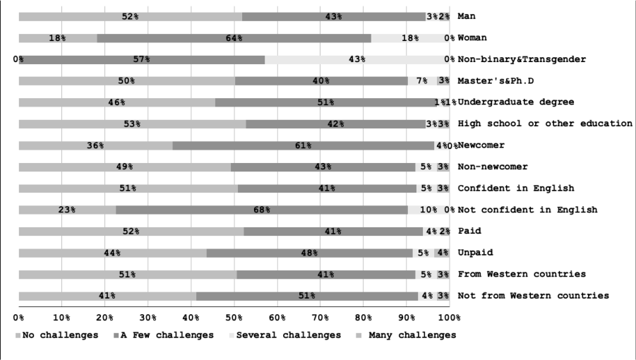

# 第38问 开源社区的包容性和多样性为何重要

## 编辑摘要（新增，非原文）

本问围绕“开源社区的包容性和多样性为何重要”展开，依次讨论多元与包容的重要性；需要解决的现实问题；提升多元与包容性的改进方案。

## 常见问法（新增检索辅助）

- 开源社区的包容性和多样性为何重要？
- 请介绍多元与包容的重要性。
- 请介绍需要解决的现实问题。
- 请介绍提升多元与包容性的改进方案。

## 原书正文（转录）

> 保留原书观点与历史案例，未作当前事实更新。正文页码按书内印刷页码；PDF页码从1起，等于书内页码加18。图示保留原图，文字说明标为整理转述。

<!-- source: q038; print_pages: 138; pdf_pages: 156–156 -->

多元（Diversity）、公平（Equity）、包容（Inclusion），这 3 个词合在一起被简称为DEI，与开源社区发展理念契合。从开源文化来说，就应该公开地欢迎所有可能的贡献与所有不同身份的贡献者。然而，事实并非如此。Apache 软件基金会在2023 年发布了一份“ASF 社区的多样性和包容性现状调查报告”，通过发放问卷的方式，调查团队在2020 年收到了624 份回复，在2022 年收到了432 份回复。我们可以只看2022 年的，被认为已经有所改进之后的数据，如图38-1 所示。

**图示文字说明（整理转述）**：横向堆积条形图比较不同性别、教育背景、新老参与者、英语信心、是否获得报酬以及是否来自西方国家的社区参与挑战。图例分为没有挑战、少量挑战、若干挑战、很多挑战；来源为Apache软件基金会。具体分组比例保留在原图中。

图38-1 不同的人参与社区时面临的挑战（来源：Apache 软件基金会）

女性、非二元性别与跨性别者、新来者、非英语国家或非西方国家的贡献者（受访者），都会面临更多、更大的挑战。从开源社区应该更多地接纳不同来源贡献的角度来看，受到阻碍的贡献者、可能最终离开的贡献者，都是开源社区的损失。

在TODO Group 发布的“构建包容性开源社区指南”中，提到了另外一些数据：2017 年麦肯锡的一份报告发现，高管团队性别多样性排名前四分之一的公司比后四分之一的公司盈利能力高出15%，而拥有文化和种族多样性的公司则高出33%。

因此，Linux 基金会于2017 年9 月宣布的CHAOSS 项目建立了标准化的、与实现无关的度量标准，以衡量开源社区的整体健康。这些度量标准中，一个关键指标就是多样性和包容性（见第14 问）。

<!-- source: q038; print_pages: 139; pdf_pages: 157–157 -->

### 38.1 多元与包容的重要性

开源社区的包容性和多样性是其成功和可持续发展的核心基石，其重要性体现在多个相互关联的维度。

（1）提升创新能力与问题解决能力。

多样化的视角、不同背景（文化、地域、性别、种族、年龄、教育、专业领域、能力水平等）的贡献者会带来独特的视角、经验和解决问题的方法。这能激发更具创造性的解决方案，避免“群体思维”，发现单一人群可能忽略的问题或优化点。

应对复杂挑战时，现代软件和技术问题日益复杂，需要多学科知识和不同角度的碰撞。多样性确保了项目能汇集更广泛的智慧来应对这些挑战。

探索更多可能性时，包容的环境鼓励大胆的想法和实验，即使最初看起来不切实际，也可能孕育出突破性的创新。

（2）提高代码质量与软件健壮性。

更广泛的测试场景下，来自不同背景的贡献者和用户能覆盖更广泛的使用场景、硬件环境、网络条件和文化习惯（如日期格式、字符编码），帮助发现更多边缘案例和潜在缺陷，使软件更健壮、更具普适性。

更全面的安全审查下，多样化的审查者能从不同角度审视代码，更容易发现潜在的安全漏洞和设计缺陷。

提升无障碍性方面，有不同障碍的贡献者（如视障、听障开发者）或关注无障碍性的人参与，能推动项目从一开始就考虑并实现更好的无障碍支持，使软件惠及更广泛的用户群体。

（3）扩大用户群体与市场覆盖。

理解多元需求时，多元化的社区更能理解和反映全球不同用户群体的需求，使产品设计更贴心，功能更符合当地习惯，文档更清晰易懂（例如，考虑非母语英语使用者），从而吸引更广泛的用户。

实现高质量软件本地化（翻译、文化适配）和国际化的关键，在于拥有来自世界各地的贡献者。

建立信任与亲和力：当用户看到社区中有与自己背景相似的人时，会更倾向于信任该项目，参与贡献或推荐使用。

（4）确保项目的长期可持续性与活力。

扩大人才蓄水池：包容的环境向所有潜在贡献者敞开大门，极大地扩展了项目可吸引的人才范围。这有助于解决贡献者短缺问题，特别是在关键维护角色上。

降低贡献门槛：强调包容性意味着关注新手友好度（清晰的文档、友好的沟通渠道、导师计划等），鼓励更多人迈出第一步并长期留下，保障项目人力的持续供给。

减少倦怠与流失：一个充满尊重、安全、归属感的社区环境能显著降低贡献者（尤其是核心维护者）的倦怠感，减少人才流失。

<!-- source: q038; print_pages: 140; pdf_pages: 158–158 -->

传承与韧性：多样化的维护者梯队降低了项目因核心成员离开而陷入停滞或消亡的风险。

（5）提升道德伦理水平与社会价值。

减少偏见：尤其是在AI、算法决策等领域，开发团队的多样性有助于识别和减少训练数据、模型设计中的偏见，避免软件产生歧视性结果，使技术发展更公平、更负责任。

促进社会公平：开源本身就是一种倡导开放、协作和知识共享的理念。在其社区内实践包容性和多样性，是这一理念的自然延伸，为更广泛的科技行业和社会树立积极榜样，推动整个行业向更公平、更开放的方向发展。

赋能边缘群体：开源为来自资源匮乏地区或传统上在科技领域代表性不足的群体提供了宝贵的学习、实践和职业发展机会。包容性确保他们能平等地获得这些机会。

（6）反映开源精神的核心价值。

开源运动的根本精神是开放、自由、共享和协作。包容性是“开放”的必然要求─开放不仅指代码开放，更意味着向所有人开放参与的机会。多样性是这种开放参与带来的自然结果和宝贵财富。一个排斥特定群体或无法容纳不同声音的项目，实质上违背了开源的核心精神。

### 38.2 需要解决的现实问题

回到具体问题，开源社区面临的独特挑战，主要有以下几个方面。

（1）女性贡献者比例偏低。

根据2016 年Bitergia 的数据，女性贡献者只有10%～11%。而根据开源社发布的“2024 中国开源年度报告”，在中国的开源开发者中，也只有28.4%为女性。将目光放宽到整个IT/科技行业，计算机科学（Computer Science）在2023 年发布的一份报告“计算机科学领域的女性”显示，“自20 世纪90 年代以来，从事计算机科学相关职业的女性比例持续下降，过去15 年从35%降至25%。”然而，整个劳动力中的女性比例则相反：如今女性占劳动力的47%，而20 世纪70 年代仅为38%。

因此，我们可以这样理解：在整个劳动力市场，女性的比例正在上升，而在IT 领域，女性的比例却在不断下降。即使在开源社区，这个趋势也不能让人乐观。

（2）对于非英语开发者的语言障碍。

开源社区通常会采用英语作为主要（甚至唯一）的沟通语言，这对于非母语者构成障碍。非英语开发者常需花费额外时间理解技术讨论，如果他们想要发起讨论、提出问题，则会面对更多的困难。这方面的问题，对于英语国家的开发者，往往都不会意识到。而在非英语国家，例如中国，却会更多地强调“开发者应该熟练掌握英文，这样才能更好地融入社区”。

<!-- source: q038; print_pages: 141; pdf_pages: 159–159 -->

当然，现在AI 翻译的工具已经非常成熟，我们可以在社区里更多地接入AI工具，协助不同国家的开发者更好地交流。

（3）新来者往往会被无视。

即使是开源社区，大家也会更多、更自然地与自己熟悉的人交流。在社区里发帖、提交问题、提交PR 的人，如果他的名字大家从未见过，他的消息往往会被无视。那些被誉为“对新人友好”的社区，并不是自然而然做到的，他们往往培养出一种重视新人体验的社区文化，社区老人会更加有意识地、友善地回答新人的提问。

我们真的希望更多的社区能够追求这样的文化。

（4）经济困难者和跨国、跨洋的贡献者可能会减少参与社区的机会。

社区除了线上交流，也经常会举行线下聚会。在很多情况下，面对面的交流是线上沟通无法替代的。但是由于经济困难，或者路途遥远、时区差距，参与面对面的交流，就会面临时间与金钱方面的困难。对于中国的开源开发者来说，去美国参加一次OSCon，或者半夜三更上线与美国的社区同仁交流，都会是很麻烦的事情。

（5）非代码类贡献的价值被低估。

开源社区有一句名言，“Talk is cheap，Show me your code”。这句话很可能被引申为：所有非代码贡献，都很“cheap”。如果一个擅长写代码的贡献者，偶尔做做非代码贡献，还可能被人称赞“能文能武”。如果是一个从来不写代码（甚至的确不擅长写代码）的贡献者，哪怕他在社区里做出了很多同样非常重要，甚至难以替代的贡献，也往往会低人一头。这的确是开源社区的“痼疾”，很难改变。

### 38.3 提升多元与包容性的改进方案

首先是建立可衡量的指标。可以参考CHAOSS 项目的健康评估框架，重点跟踪不同背景贡献者的留存率、非代码任务（文档/测试）占比及跨时区协作响应速度。当然，更好的就是向Apache 软件基金会学习，在自己的社区也做类似的“多样性与包容性现状调查”。

其次是降低门槛，鼓励更多的新手成为贡献者。例如，设置新手任务，用“good-first-issue”标签标识简单任务；配置AI 工具，帮助其他语言的开发者更好地与社区交流；设立本地社群，如Apache Local Community，一方面传播Apache文化，另一方面也能够鼓励更多本地开发者加入Apache。

再次是提供某种经济支持。例如，对遥远国度、贫困地区的开发者给予一定倾斜比例的差旅补助，这样能够更好地帮助那些地区的开发者，到社区“总部”，与大家面对面交流。

最后是组建多元背景的仲裁小组。在第37 问中提到的沟通与决策流程中，需要更加仔细地处理矛盾冲突，避免因为不了解、不理解、不能共情，而在自以为公正、公开的情况下伤害到其中一方（甚至双方）。

## 来源与整理说明

来源：《解码开源：开源生态60问》，庄表伟，第38问；书内第138–141页；PDF第156–159页。
拟定网页路径：`/questions/q038/`（尚未发布）。
摘要、关键词、常见问法与图示说明为新增整理内容；正文与表格保留原稿内容。