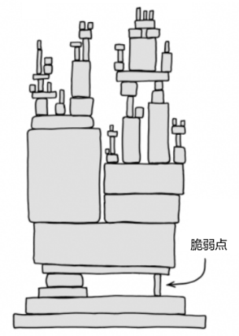

# 第40问 开源项目如何保障其长期可持续发展

## 编辑摘要（新增，非原文）

本问围绕“开源项目如何保障其长期可持续发展”展开，依次讨论经济可持续性；治理可持续性；技术可持续性；项目可持续性与生态可持续性。

## 常见问法（新增检索辅助）

- 开源项目如何保障其长期可持续发展？
- 请介绍经济可持续性。
- 请介绍治理可持续性。
- 请介绍技术可持续性。

## 原书正文（转录）

> 保留原书观点与历史案例，未作当前事实更新。正文页码按书内印刷页码；PDF页码从1起，等于书内页码加18。图示保留原图，文字说明标为整理转述。

<!-- source: q040; print_pages: 144–145; pdf_pages: 162–163 -->

开源项目作为技术创新的重要驱动力，其长期可持续发展对全球数字经济的稳定可持续发展至关重要。然而在繁荣兴旺的开源社区背后，资金短缺、治理机制缺失、技术分歧引发的社区分裂等问题持续威胁着开源生态的健康发展。面对这一挑战，全球开源社区都在进行各种尝试，希望能够为开源项目的长期发展提供更好的保障。下面将从资金机制、治理模式、技术实践和产业协同4 个维度，解析开源项目长期发展的核心要素。

<!-- source: q040; print_pages: 145; pdf_pages: 163–163 -->

### 40.1 经济可持续性

虽然的确存在很多单人维护的开源项目，长期不求回报，只是出于个人兴趣的开源贡献者也有很多。但是，更多的开源项目，都需要稳定的资金支持。在本书的第3篇，讨论了不少与开源商业模式有关的话题。但是这里所说的经济可持续性，并不是从开源企业的角度，而是从开源贡献者应当获得合理回报的角度来讨论的。我们可以将投入开源的贡献者，分为以下几种情况，可持续的有3 种，不可持续的也有3 种。

- 可持续：自身经济状况无虞，业余时间投入开源。

- 可持续：企业聘请的开发者，以企业员工身份投入开源。

- 可持续：开源企业，并且找到了成功的开源商业模式。

- 不可持续：通过开源项目，寻求捐赠，收入不稳定。

- 不可持续：业余时间投入开源，工作繁忙，时间不够，投入不稳定。

- 不可持续：开源创业公司创业失败，项目终止。

对于后面的3 种情况，其实并没有太好的解决方法。目前，有开源基金会在尝试直接资助开源贡献者的方式，能够解决一部分问题。另外，就是通过开源治理，想办法繁荣开源社区，提高BUS 系数①。

### 40.2 治理可持续性

在开源社区里，总会产生各种不同的矛盾。小的矛盾可能会导致贡献者愤怒、沮丧、对社区失去信心，甚至选择离开社区。更大的矛盾则可能导致社区分裂，甚至完全解体。所以，我们才会在第37～38 问，讨论社区的冲突管理，以及包容性与多样性建设。

在下一个问题中，我们还会讨论社区的规则与潜规则，本质上也是在研究如何进行治理，才能帮助社区长治久安。

这里简单地讨论一下社区治理总的原则：存异才能求同，志同才能道合，和衷才能共济。

开源社区由全球开发者自发组成，个人背景、技术偏好、文化观念各异，只有尊重差异、包容差异，才能在差异的基础上找到共同点，找到最大公约数。如果求同是一味追求完全一致，就会导致社区要么变成一言堂，要么最后分崩离析。

如果要“求同”，最需要的是“明确的核心目标”（志），这样才能吸引志同道① BUS 系数，是指项目中有多少关键开发者一旦被公交车撞了（比喻突然离开），项目就会陷入瘫痪或无法继续，是一个衡量项目可持续性和风险承受能力的指标。

<!-- source: q040; print_pages: 146; pdf_pages: 164–164 -->

合者，社区才能不断地发展壮大。否则，易沦为无序的“乌合之众”，或者表面一团和气，实则无所作为的清谈社区。

“和衷”是指大家心意一致、团结一心，“共济”是指共同渡过难关。在一帆风顺的时候，社区自然容易发展顺利。但是在遇到困难时，社区的成员能不能团结起来，共同渡过难关，关键还是在于社区成员的核心目标是否一致。

开源社区的治理本质是“在多样性中寻找共识，在共识下构建协作”，这也是为什么Apache 软件基金会一直在强调“Community Over Code”的原因。

### 40.3 技术可持续性

开源项目的技术可持续性取决于其架构演进能力、维护效率和安全机制三大支柱。

关于架构演进能力，一个典型的案例是Python 语言。如果像Python 社区那样，突然宣布要以不兼容的方式进行升级，从Python 2 升级到Python 3，当然会引发轩然大波。更加合理的做法，就是在架构设计时，更具前瞻性，考虑到可能的演进方向，避免在项目发展的中后期，造成不可挽回的局面。

关于维护效率，就需要提到贡献者倦怠感的问题。在特别繁荣、热闹的社区中，开源贡献者尤其是维护者，可能会产生严重的倦怠感。这就需要我们通过各种各样的智能化、自动化的技术手段，降低社区维护的成本，提高维护效率。只有把开源贡献者从烦琐的维护工作中解放出来，才有可能引导他们去做更多有创意、有价值、能够带来自豪感的工作。

关于安全机制，有一幅著名的漫画（见图40-1），就是在复杂架构中，总是会存在脆弱点。而一个开源软件，如果存在这样的脆弱点，一旦安全风险爆发，就会给用户，当然也会给项目自身带来巨大的灾难。著名的OpenSSL 心脏滴血漏洞，就是这样的案例。

**图示文字说明（整理转述）**：漫画将复杂技术架构画成层层堆叠的结构，并标出底部细小支撑处的脆弱点，用以说明重要依赖可能成为整个系统的薄弱环节。原图署名Randall Munroe，来自xkcd。

图40-1 架构中的脆弱点（Randall Munroe 创作，来自xkcd）

<!-- source: q040; print_pages: 147; pdf_pages: 165–165 -->

总之，我们在考虑开源项目的架构与技术决策时，需要仔细思考技术可持续性，以免在危机发生时，承担难以估量的代价。

### 40.4 项目可持续性与生态可持续性

上述的讨论，都只是从项目层面来考虑的可持续性。至于整个生态层面，我们还需要考虑以下问题：什么样的开源项目可能存在经济可持续性的风险，如何找到这些项目，如何帮助这些项目？以及什么样的开源项目会有治理可持续性风险、技术可持续性风险？

总之，从整个生态的角度，如何才能找到那些在可持续性上存在问题，但又难以自己解决的项目，然后找到一些有效的方法去帮助它们。这就是开源基金会，甚至是国家层面的开源政策，需要考虑的问题。

## 来源与整理说明

来源：《解码开源：开源生态60问》，庄表伟，第40问；书内第144–147页；PDF第162–165页。
拟定网页路径：`/questions/q040/`（尚未发布）。
摘要、关键词、常见问法与图示说明为新增整理内容；正文与表格保留原稿内容。