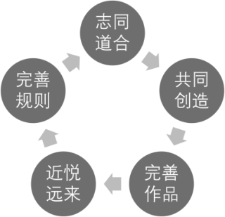

# 第41问 开源社区里的规则与潜规则有哪些

## 编辑摘要（新增，非原文）

本问围绕“开源社区里的规则与潜规则有哪些”展开，依次讨论社区、潜规则与规则；开源伦理的演进；社会之礼与社区之礼；开源社区里的“成文法”与自动化规则等内容。

## 常见问法（新增检索辅助）

- 开源社区里的规则与潜规则有哪些？
- 请介绍社区、潜规则与规则。
- 请介绍开源伦理的演进。
- 请介绍社会之礼与社区之礼。

## 原书正文（转录）

> 保留原书观点与历史案例，未作当前事实更新。正文页码按书内印刷页码；PDF页码从1起，等于书内页码加18。图示保留原图，文字说明标为整理转述。

<!-- source: q041; print_pages: 147; pdf_pages: 165–165 -->

### 41.1 社区、潜规则与规则

本篇一直在讨论开源社区，却尚未论及开源社区的成长规律。开源社区的成长规律如图41-1 所示。

**图示文字说明（整理转述）**：开源社区成长规律以循环表示：志同道合→共同创造→完善作品→近悦远来→完善规则→志同道合。

图41-1 开源社区的成长规律

一个开源社区的形成，往往始于一群志同道合者的聚集。他们因为共同的理想、兴趣或目标，走到一起，开始创造某种作品，如开发一款开源软件。在这个过程中，伴随着对项目的持续打磨、改进和优化，社区逐渐形成，并逐步发展出独特的氛围和文化，吸引更多人因产品质量、项目价值或社区氛围而加入。这种吸引力带来的是“近悦远来”的效应：既能让原有成员持续投入，也不断吸纳新成员。

<!-- source: q041; print_pages: 147–148; pdf_pages: 165–166 -->

然而，随着社区规模的扩大，成员数量的增加，各类矛盾与分歧也随之增多。此时，社区成员会开始意识到规则建设的重要性，并在实践中不断完善社区的运作规范。这一规则的制定与完善，并非源自外部强制，而往往是社区内部对“何为可为，何为不可为，何者应当鼓励，何者应当避免”的集体性反思。这种反思促使社区回溯初心：我们为何聚在一起？我们希望建设一个怎样的社区？我们的共同愿景是什么？正是在这样的集体意识和价值追问中，规则才逐步建立并得以优化。

<!-- source: q041; print_pages: 148; pdf_pages: 166–166 -->

这一过程本质上是一个循环：从“志同道合”的初衷出发，发展出开放而有吸引力的社区氛围，继而通过实践中不断暴露的问题引导规则建设，而规则的建设又反过来强化社区的凝聚力和目标认同。如果这个循环能够良性运转，社区就会不断吸纳新人、积累经验、提升运作水平，创造出更有价值的开源成果。

在这一演化过程中，最初的规则往往是“潜规则”─即未被明确书写、却被成员普遍默契遵循的行为准则。这些潜规则源于早期成员之间的信任关系和互动经验。但随着人多事杂、情境复杂，社区对“明确、清晰、可执行”规则的需求逐渐增加，原本的潜规则就会转化为显性的成文规则。

例如，在一个新建的微信群中，如果某人发布广告，引发了不适或干扰，群主可能会制定第一条规则：“发布广告前必须发红包”。随着情况变化，规则可能进一步升级为“必须发大红包”。这种规则的演变，反映了从潜规则向明规则的逐步过渡。但即便如此，这些规则的执行仍可能受到群体关系、管理者偏好等非公开因素的影响。如果某人和群主关系密切，即使违反规则也可能不受惩罚。这就使得潜规则仍然在显规则之下发挥作用。

在更大规模的社区中，类似的潜规则现象也随处可见。社区成员会通过观察“某人为何被禁言”“某帖为何被删除”等现象，推测背后的原因。这些推测不仅反映了成员对规则的认知不确定性，也说明了在规则背后仍有一套未明说却起作用的“隐性逻辑”在运行。可以说，没有哪一个社区是完全没有潜规则的，完全公开透明的社区规则几乎不存在。

从形态与可执行性来看，社区规则可以分为4 个层级：情、礼、法与Code（代码）。

首先是“情”─即人际关系中的基本伦理，如亲疏远近、人情冷暖，这是最朴素的交往基础；其次是“礼”─即行为的规范与仪式感，强调对他人的尊重、界限感与礼节，如“礼尚往来”“有礼有节”等；第三是“法”─即成文的规范与制度，包括法律条文、许可证、贡献者协议（CLA）等，具有相对的强制力与明确性。

然而，现代社区运行并未止步于此。随着技术的发展，我们开始进入“Code”的阶段。所谓“Code”，并不仅仅是编程意义上的代码，而是一种“可自动执行的规定”。举例而言，一张门禁卡可以控制门的开启权限，本质上就是将“允许哪些人进入”的规则写入了程序中，由系统而非人来执行。这种规则不再依赖管理者的主观判断，也无须解释或辩论，而是通过技术手段实现了高度自动化和执行一致性。

<!-- source: q041; print_pages: 148–149; pdf_pages: 166–167 -->

从历史角度来看，规则的演进也体现了人类社会治理的演化路径：在小规模社会中，靠的是“道、德、仁、义”等较为抽象的价值指引；当社会变得更复杂，人们便依赖“礼”来维系秩序；再进一步，出现了需要执法者、法官、律师等专业力量参与的“法”；而如今，进入数字社会，部分规则已被“Code”所替代，并实现了即时、自动、无歧义的执行机制。

<!-- source: q041; print_pages: 149; pdf_pages: 167–167 -->

综上所述，开源社区的规则体系既包含明确制定的显性规则，也包含根植于人际互动和文化氛围中的潜规则。社区的健康发展，依赖于这两者之间的良性互动：显性规则提供了可操作性与一致性，潜规则则反映出社区文化的深层价值。理解并善于运用这套“情—礼—法—Code”的规则体系，是推动开源社区持续繁荣的重要保障。

### 41.2 开源伦理的演进

开源伦理的发展共经历3 个阶段，其初始阶段以精英伦理为主导。该阶段被学界与业界广泛认为是“真正的开源伦理”，亦即“开源伦理的核心”。在这一阶段，早期开源领域的技术先行者一方面打造了诸多具有行业影响力的经典开源项目，另一方面也奠定了以黑客伦理为标志的开源伦理基础观念。

- 协作与共享：开源社区强调协作与共享，认为通过开放代码，所有人都可以受益并共同进步。

- 透明带来信任：代码是公开的，任何人都可以审查和改进，从而建立一种基于透明度的信任文化。

- 自由的权利：开源倡导软件自由，强调用户应当有使用、修改和再分发软件的自由。

然后就进入了商业伦理冲击的阶段。随着开源软件不断蚕食商业软件的市场，商业伦理也开始对开源运动产生冲击。在这一阶段，越来越多的商业公司认识到开源软件的潜力，并开始参与其中。公司逐渐将开源软件纳入其商业战略，通过开源来降低开发成本、提高市场竞争力和促进技术创新。这一阶段的伦理变化主要体现在以下几个方面。

- 商业化与盈利：公司通过提供开源软件的商业支持、定制服务和增值产品来实现盈利，这在一定程度上改变了开源社区的原有价值观。RMS 曾经严厉地批评过通过商业利润来支持开源的逻辑，但是他的批评无法阻拦这样的趋势。

- 知识产权与许可：商业公司更加关注知识产权保护和许可协议的制定，以确保在开源合作中的权益。尊重版权、注重合规义务，成为与尊重开源贡献同等重要的伦理要求。

- 社区与企业关系：公司需要平衡开源社区的利益与企业的商业目标，这要求建立新的合作模式和伦理规范。我们常说有些公司不会玩开源，把一些糟糕的玩法带到开源社区，就是因为商业伦理与开源伦理之间出现的冲突。

目前，我们正在经历的是外部伦理冲击的阶段。在开源软件广泛普及和应用的背景下，外部伦理因素开始对开源运动产生重大影响。这些因素包括社会责任、隐私保护、数据安全和地缘政治等。这一阶段的开源伦理变化主要体现在以下几个方面。

<!-- source: q041; print_pages: 150; pdf_pages: 168–168 -->

- 社会责任与政治正确：开源社区和公司越来越多地关注社会责任，强调开源技术应当服务于社会公益和可持续发展。进一步的说法就变成了：开源不应该成为恶势力的帮凶，开源应该追求政治正确、社会正义，于是道德源码运动随之兴起。

- 隐私与安全：随着开源软件在敏感领域的应用增加，隐私保护和数据安全成为重要的伦理考量。开源项目需要在代码开发和使用中严格遵守隐私和安全标准。这方面的案例，在本文并未提及，但也确实是非常重要的议题。

- 地缘政治议题的冲击：生来就是国际化的、全球协作的开源社区，遭遇了各种各样的地缘政治危机，敌对国家的开发者，能不能在一个开源社区里协作？一款开源软件，要不要声明支持一方而反对另一方？更有甚者，政治性的软件投毒也开始出现了！开源社区，是否能够坚守自己的伦理底线，明确有些事情绝不可为？

当开源不再是一小群黑客们自娱自乐的小园地，而是深刻地嵌入整个世界运行之中时，开源的伦理原则应该如何确定？这是一个越来越难以回答的问题了！

### 41.3 社会之礼与社区之礼

“礼”在社会规范中占据重要地位，其内涵可以进一步细分为礼仪、礼节与礼物3 个层面。

首先，礼仪是社会生活中为维系秩序、体现尊重而形成的仪式化行为规范。例如，在婚丧嫁娶等重大人生节点，人们往往会举行仪式、设宴请客，以表达情感与建立社会联系。这种礼仪不仅是个体行为的表达，更是集体文化的体现。开源社区中亦存在相应的“社区礼仪”，如社区大会上成员之间的重逢、寒暄与交流，以及在群体交流过程中，如何恰当地介绍自己、引荐他人、把握交流分寸等，均构成了社区内部的礼仪规范。

其次，礼节主要体现于人与人之间日常交往中的行为规范与礼貌方式。在社会生活中，初次见面时使用怎样的称谓、采取何种姿态进行沟通，均反映了一个人是否具备基本的礼节意识。在开源社区中，同样存在相应的礼节规范。例如，当新人首次在社区中发起提问时，提问的方式、语气和内容往往直接影响其获得回应的质量与态度。诸如“跪求答案”“急！在线等”等措辞，往往被视为不尊重他人时间和精力的表现，容易引发反感。相反，以理性、清晰、客观的方式表达问题，反而更容易获得他人的尊重与帮助。这不仅是一种沟通技巧，更体现了对社区文化的理解与尊重，体现了“提问的艺术”所蕴含的礼节价值。

<!-- source: q041; print_pages: 150–151; pdf_pages: 168–169 -->

最后，礼物作为一种社会交换的重要媒介，也在社区文化中占有重要位置。在传统社会、现代社会乃至原始部落中，那些最慷慨的贡献礼物者往往拥有最高的社会地位。这种“礼物赋权”机制在开源社区中亦有鲜明体现。如《大教堂与集市》一书所指出，开源社区的成员之所以愿意将自己辛苦编写的代码无偿贡献出来，正是基于一种“礼物文化”的价值观。在这种文化之中，代码不仅是技术成果，更是一份向公众提供的共享礼物。那些贡献了高质量、关键性代码的开发者，往往因其无私的分享而赢得社区的广泛尊敬与崇高地位。

<!-- source: q041; print_pages: 151; pdf_pages: 169–169 -->

因此，从礼仪到礼节再到礼物，构成了社区运行中“礼”的三重维度。它既是文化认同的体现，也是建立秩序、促进协作、巩固关系的重要机制。在开源社区中，“礼”不仅是一种外在行为规范，更是一种内化于人心的价值信念，支撑着社区的健康运转与可持续发展。

### 41.4 开源社区里的“成文法”与自动化规则

很多开源项目的根目录，都会存放各种规则文档。

- 贡献指南（CONTRIBUTING.md）、代码风格（code_style.md）、测试标准等：保障贡献质量、降低协作成本。

- 行为准则（CODE_OF_CONDUCT.md）：应对社区多元文化冲突的产物，著名的Contributor Covenant 就被数万项目采用。

- 开源许可证（License）：开源项目需在法律框架内运作，许可证决定代码可否被商用、修改、再发布。可以看成开源社区最重要的“成文法”，关于许可证的类型与特点参见第6 问。

总体而言，社区中存在两类规则：一类是供成员事先阅读并自愿遵守的规范；另一类则无须事先通读，却必须被强制执行的规则。后者通常通过代码或配置的方式加以实现，因而具备自动化和强执行力的特征。

美国著名的开源与互联网法学家劳伦斯·莱斯格（Lawrence Lessig）在其代表作《代码2.0》中提出了著名的观点：“Code is Law”（代码即法律）。他认为，在数字时代，凡是可以通过代码自动执行的规定，将在社区、社会乃至全球范围内占据越来越重要的地位。代码不仅仅是程序语言，它本质上是一种规范执行机制，能够在无须解释与人为干预的前提下，自动完成规则的实施。

以笔者曾经参与过的JavaEye 社区为例，这是国内较早引入“积分—权限挂钩机制”的开源社区之一。在该社区中，新注册用户初始等级为“一星”，随着发帖数量和活跃度的提升，等级逐渐上升为“二星”“三星”直至“五星”，其后还可以获得“一皇冠”至“五皇冠”的称号。这一等级体系并不仅仅是荣誉的象征，更直接影响用户在社区中的权限与影响力。例如，当一篇帖子被多位用户标记为“垃圾帖”后，最终是否被移至垃圾箱，不取决于票数本身，而取决于累计的积分权重。当负面积分达到一定阈值（如20 分）时，系统会自动将该帖移除。每位用户的投票权重依据其等级而定，等级越高，影响力越大。

类似的积分与规则体系在其他开源社区中也有广泛实践，例如，Stack

Overflow、SegmentFault（思否）等，它们都通过设计各自的积分系统，实现社区治理的自动化与精细化。GitHub 亦是如此，其引入的自动化工具，如Actions、Robots，以及近年来广泛应用的Issue 与Pull Request 模板（Issue & PR Template），共同构建了一套以“代码即规则”为核心的社区协作机制。

<!-- source: q041; print_pages: 152; pdf_pages: 170–170 -->

此外，代码评审工具Gerrit 所体现的规则性也值得一提。在Gerrit 中，一段代码是否可以被合并入主干，往往依赖于是否获得了多个审阅者的“通过”意见。例如，当两位或三位审阅者给予积极评价后，系统便允许代码合并。这种机制本质上也是规则的代码化体现。

笔者所在的公司也设计并实践了一套基于积分的代码评审机制。我们可以设定规则：当某段代码获得的“支持积分”超过设定阈值（如3 分或5 分）时，才允许其被合并。每位审阅者的投票权重设定为1 至2 分，这样一来，随着团队人数的增长，获得代码合并所需的“赞成比例”也会相应提高，从而有效提升代码质量控制的门槛。

综上所述，借助代码实现的规则体系能够大幅提升社区管理的效率与公平性。这类规则具备可预测性、可执行性与一致性，是应对复杂社区行为、调节多方利益关系的有效手段。正如莱斯格所言，随着技术的发展，“代码即法律”不仅是一个技术命题，也正在成为一种社会现实。

### 41.5 社区中的潜规则

（1）人设的重要性。

在社区中，“人设”（即个人在群体中的角色形象）具有重要意义。成员在社区中如何被他人认知，其自我定位如何，直接影响其所能获得的关注、尊重与影响力。

例如，社区中常见一种类型的用户，几乎仅以“发帖—发红包—请求转发”为行为模式。他们往往是处于社区认同体系最底层的群体，无论其行为是否出于无奈，其形象难以获得他人的尊重与信任。这种“发帖机器式”的人设，往往不被重视，难以建立有效的长期连接。

曾有一次，笔者在微信群中与某知名商学院的教授交流时，发现他将自己撰写的文章反复发布至群中。当群主提示其“重复发帖”时，他轻描淡写地回应“抱歉，不小心发错了。”笔者提醒他，社区中“人设”尤为关键。即便他的文章内容优质，但一旦形成“发帖机器”的负面人设，其作品也可能因此被忽略。

这类潜在的规范通常并非明文规定，却具有极强的行为约束力。一旦被打上负面标签，其在社区中的发展空间将大幅受限。许多刚刚开始从事社区运营的年轻成员，尤其容易陷入这一误区，低估了人设对长期发展的影响。

因此，建议社区运营者，尤其是初入者，应主动构建更加积极、专业的人设。例如，通过持续理性发言、深入交流、分享有价值的信息，从而塑造“值得信赖的分享者”“理性思考者”乃至“意见领袖”（KOL）等更高阶的角色定位，进而赢得广泛认可。

<!-- source: q041; print_pages: 152–153; pdf_pages: 170–171 -->

此外，也有部分成员以制造争议或“刷存在感”为目标，表现出攻击性、对抗性或偏执特质，俗称“杠精”。此类成员虽可能在短期内带动讨论热度，但从长期看，会破坏社区的理性氛围，损害交流质量。若以“KPI 导向”运营社区，或许会暂时容忍此类“有毒流量”；但若以社区健康、可持续发展为目标，则应及时识别并排除这些破坏性因素。

<!-- source: q041; print_pages: 153; pdf_pages: 171–171 -->

（2）规则的“弹性”与社区中的不平等现象。

开源社区存在一种结构性张力，即“人人平等”与“精英治理”之间的矛盾。

初期阶段，成员之间的地位相对平等。但随着时间的推移，那些在代码、项目或协作上作出显著贡献的成员，往往获得更高的影响力、更大的话语权，甚至某些不成文的“特权”。这导致同样的行为，来自不同角色者所遭遇的评价与后果可能存在显著差异。

例如，知名开源人物林纳斯·托瓦兹在社区交流中曾多次使用激烈语言，甚至有不当举止。尽管有部分成员表达批评，但因其作为Linux 创始人的权威地位，往往被更多人视作“直率”“风格独特”，并未受到实际惩处。

这种现象说明，在社区中，规则的执行标准并非一视同仁。在理想状态下，社区应建立对所有成员相对公平的规则体系，尤其是在面对新人时，避免“门槛过高”“排他性强”的倾向。否则，社区将难以吸引与培养新生力量，从而陷入“内卷”与“老化”。

具备高度自我认知的社区，若未及时调整其对新人的接纳机制，常会表现出更强的苛责与审视。这种文化虽然源于对质量的坚守，但也可能限制社区的成长与包容性。

（3）社区的内部沟通与隐性结构。

在多数社区，尤其是基于即时通信功能（如微信群）构建的社区组织中，除了公开讨论空间，往往还存在一些成员数量较少、较为私密的“内部小群”。这些小群形成了社区的“隐性沟通结构”，用于协调意见、反馈问题，甚至形成舆论引导。

以笔者亲身经历为例，曾在某微信群中出现一位长期以争辩和否定他人为主要行为特征的用户。虽然他在公开频道中引发了多轮争论，也激活了一定的讨论热度，但多数成员对其行为表示不满。随后，笔者私下与群主沟通，建议将其移除。几日后，该用户被清退，群内氛围明显趋于和谐。

这一过程反映出社区运作中的典型“潜规则”：虽然未设明文条款，但实际操作中，社区管理者通过私下反馈、小范围磋商完成决策。

因此，对于社区的运营者而言，除掌握显性规则外，更须具备对社区氛围的敏感度与判断力。即便在制度相对完善的社区中，管理者的“直觉”与“判断力”仍起着不可替代的作用。例如，何时应强制执行某项规则、某位成员的行为是否构成破坏、是否需要调整某项机制等，这些都无法完全依赖自动化或既定流程，而需依赖运营者的经验与判断。

### 41.6 社区运营的艺术

对于运营社区的管理者来说，往往处于两难的处境之中。

<!-- source: q041; print_pages: 154; pdf_pages: 172–172 -->

- 尊重贡献者与保护新手。

- 严格执行规定与照顾大家的面子。

- 追求透明度与通过私下沟通寻求妥协。

- ……

总之，如何寻求平衡之道？还是需要管理者有足够的“品位”。他要能够沉浸在社区里，不断地感受社区是好还是坏，不断地去体会、理解这个社区的规则是如何运行的，如何发生作用，还要不断磨炼自己的技艺，最后才有可能创造出一个越来越好的社区。

## 来源与整理说明

来源：《解码开源：开源生态60问》，庄表伟，第41问；书内第147–154页；PDF第165–172页。
拟定网页路径：`/questions/q041/`（尚未发布）。
摘要、关键词、常见问法与图示说明为新增整理内容；正文与表格保留原稿内容。