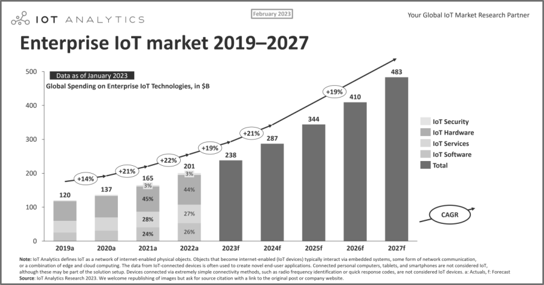
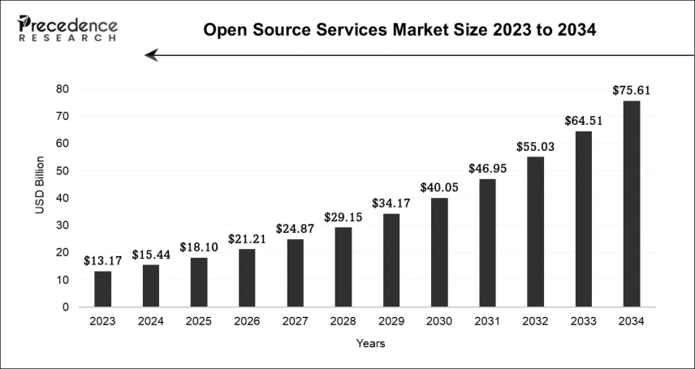

# 第45问 开源如何影响物联网领域的发展

## 编辑摘要（新增，非原文）

本问围绕“开源如何影响物联网领域的发展”展开，依次讨论降低成本与开发门槛；加速创新与迭代；推动互操作性与标准化；增强安全性与透明度等内容。

## 常见问法（新增检索辅助）

- 开源如何影响物联网领域的发展？
- 请介绍降低成本与开发门槛。
- 请介绍加速创新与迭代。
- 请介绍推动互操作性与标准化。

## 原书正文（转录）

> 保留原书观点与历史案例，未作当前事实更新。正文页码按书内印刷页码；PDF页码从1起，等于书内页码加18。图示保留原图，文字说明标为整理转述。

<!-- source: q045; print_pages: 166; pdf_pages: 184–184 -->

根据财富洞察报告（Fortune Business Insights）对物联网的市场分析，2025 年全球物联网市场规模为787.1 亿美元。预计该市场将从2026 年的971.0 亿美元，增长到2034 年的5209.3 亿美元，在预测期间显示出23.36%的复合年增长率。

而根据国际数据公司（IDC）的报告：全球物联网支出在2021 年为6902.6 亿美元，预计2026 年，全球物联网（企业级）支出规模将达到1.1 万亿美元，五年复合增长率（CAGR）为10.7%。

不同权威机构的预测，计算口径不一，数据互相矛盾，但存在一个共通之处：“大家都知道物联网市场巨大，但无人确知究竟有多大”。基于不同口径得到的增长率，从最低的10.7%到最高的23.36%不等。

在这样飞速发展的过程中，开源技术在这一背景下迅速崛起，既降低了门槛，又促进了协作，成为推动物联网创新的关键力量。

<!-- source: q045; print_pages: 167; pdf_pages: 185–185 -->

### 45.1 降低成本与开发门槛

开源的最大价值之一，是让物联网开发变得更经济、更普惠。通过软件和硬件层面的创新，降低了准入门槛和成本。软件层面，开源实时操作系统（RTOS）和中间件支持多样化硬件，简化开发流程；硬件层面，开源平台和芯片使原型设计和量产更易实现。

在软件领域，多个开源项目推动了物联网的普及。Zephyr OS 作为Linux 基金会的项目，专为物联网设备设计，支持数百种MCU 架构，其模块化架构和丰富网络功能（如内置安全协议）使其被英特尔、Nordic 等公司用于商用设备。FreeRTOS 由AWS 维护，全球下载量超数百万次，应用于医疗和工业控制系统。例如，飞利浦医疗和霍尼韦尔的产品中使用了这些开源项目，提供实时任务调度和内存管理。Eclipse Mosquitto 则是一款轻量级MQTT Broker，可运行在仅1MB 内存的嵌入式设备上，适合低资源环境，并通过开源许可促进消息传递协议的集成。这些项目通过社区协作，提升了开发效率和安全性。

硬件开源同样驱动了物联网的经济性。Arduino 作为开源电子原型平台，全球销量已超过 1700 万块，成为教育、原型开发的标准工具，其易用性和灵活性支持快速迭代。ESP8266/ESP32 由乐鑫科技推出，是高性能、低功耗的Wi-Fi 芯片，受益于开源SDK（如ESP-IDF 和Arduino 支持），广受开发者青睐；ESP32 系列支持蓝牙、Wi-Fi 和多种编程语言（如MicroPython），年出货量据报道称超1 亿颗。这些硬件方案降低了设备成本，加速了智能家居和工业应用的部署。

有报道称，深圳一家智能家居创业公司仅用ESP32+Zephyr+Mosquitto 组合，在3 个月内完成了智能插座原型开发，并将硬件成本控制在3 美元，相比专有方案节省了近60%的预算。Zephyr 提供跨平台兼容性，缩短开发周期；Mosquitto 实现轻量级通信；ESP32 的高集成度和低成本特性（如外围器件少）有助于成本控制，这凸显了开源方案潜在的经济优势。

### 45.2 加速创新与迭代

开源技术的全球协作模式显著推动了物联网领域的迭代效率。通过社区驱动的开发机制，项目可在高频更新中快速验证技术方案，降低企业试错成本。例如，Node-RED（由IBM 发起）通过可视化流程编排能力，使开发者无须深入编码即可连接硬件设备与云服务。某能源公司利用其模块化特性，仅用6 周便将风力发电机组的状态监控系统从原型部署至生产环境，大幅缩短了传统工业系统的开发周期。

<!-- source: q045; print_pages: 167–168; pdf_pages: 185–186 -->

资源受限的终端设备通过开源框架获得AI 能力，成为物联网普惠化的关键突破。TensorFlow Lite Micro 作为轻量级机器学习引擎，支持在16KB RAM 的微控制器（MCU），如Cortex-M 系列MCU 上运行模型。这使得低功耗传感器能直接在边缘端执行异常检测、语音识别等任务，减少云端依赖并提升实时性。其开源特性还催生了丰富的模型优化工具链，帮助中小企业以低成本实现智能化升级。

<!-- source: q045; print_pages: 168; pdf_pages: 186–186 -->

分布式账本技术为物联网数据提供了可信存证基础。Hyperledger Fabric 作为企业级区块链平台，通过权限管理和拜占庭容错机制确保数据不可篡改。这一方案将传统数月的审计流程压缩至分钟级。沃尔玛中国基于它搭建食品溯源平台，物联网传感器采集的冷链温度数据及时存证，提升了供应链透明度。

上述案例印证了开源技术对促进企业创新的“杠杆效应”。通过复用成熟组件（如Node-RED 的流程引擎、TensorFlow 的模型库、Hyperledger 的智能合约），企业可聚焦差异化创新而非底层重建。这种“站在巨人肩膀上”的模式，通过社区支持加速了创新迭代与商业化进程。

### 45.3 推动互操作性与标准化

开源协议是物联网的“公共语言”体系，物联网的碎片化生态依赖开源协议实现底层互通。MQTT 作为发布/订阅消息协议的标杆，通过Eclipse Mosquitto 等开源实现，成为设备—云端数据管道的事实标准。其轻量化特性（仅需1MB 内存）支撑了从智能家居到工业监控的规模化部署，并于2016 年获ISO/IEC 国际标准认证，奠定了协议级互操作性基础。

针对低功耗场景，CoAP 协议由IETF 标准化设计，采用UDP 传输与二进制编码，在16KB RAM 的微控制器上实现HTTP 兼容通信。例如，农业传感器通过CoAP 多播功能向网关批量上报数据，降低40%网络能耗，解决了NB-IoT 等窄带网络的资源瓶颈。

在工业网关层，Eclipse Kura 提供开源协议转换框架，集成Modbus、OPC UA等20 余种工业协议驱动。其Java OSGi 架构允许开发者动态加载厂商定制协议插件，将西门子PLC 与三菱机械臂数据统一转换为MQTT 上行，破解了OT/CT 系统融合难题。

低功耗广域通信（LPWA）的碎片化生态曾长期受制于供应商锁定问题。LoRaWAN 协议通过开源网络栈（如ChirpStack、TTN）构建标准化通信层，使终端设备、网关与应用服务器解耦。在荷兰鹿特丹的智慧水务系统中，这一价值得到充分验证：水务局混合采购5 家厂商设备，所有设备通过LoRaWAN OTAA 激活流程接入统一ChirpStack 服务器，Join Server 自动分配跨厂商安全密钥。网关实时上传设备健康状态（如电池电压、信号强度），AI 算法预判故障节点，现场维护频次减少60%；开源网络服务器支持跨厂商设备的空中升级（FUOTA），修复漏洞无须物理接触终端；所有传感器数据经MQTT 转发至统一云平台，破除原有“数据孤岛”导致的多系统维护负担。根据鹿特丹 2024 年审计报告，实际运维费用降幅18%～30%。

上述案例也证明了我们在前文讨论的开源标准能够为整个产业带来巨大的价值。与传统的标准化方式相比，针对标准快速推出的开源实现，能够充分调动行业的协作力量，打破生态碎片化的魔咒。

<!-- source: q045; print_pages: 169; pdf_pages: 187–187 -->

### 45.4 增强安全性与透明度

安全一直是物联网的软肋，而开源在这一领域的作用并非“免费但不安全”，而是通过透明性提升防御能力。开源安全工具（如OpenSSL 和WireGuard VPN）允许全球安全专家审查并快速修补漏洞。

以著名的开源项目WireGuard VPN 为例，这是一项加密VPN 协议和自由及开源程序。旨在获得比IPsec 和OpenVPN 更好的性能，后两者都是常见的隧道协议。WireGuard 协议的流量经由UDP 传输。2020 年3 月，该软件的Linux 版本达到了稳定的生产版本，并被纳入Linux 5.6 内核，并在一些Linux 发行版中向后移植到早期的Linux 内核。

ArsTechnica 的一篇评论表明，WireGuard 易于设置和使用，使用了强大的加密算法，并且代码库最小，攻击面小。另有专门的研究论文对此进行了深入的分析，表明WireGuard 为资源受限的物联网设备提供了高效安全连接的可能性。

值得注意，也是本书反复提及的社区响应：活跃的开源社区通常能够更快地响应和修复发现的安全漏洞，这对于物联网安全至关重要。

### 45.5 构建繁荣生态与商业模式

根据IoT Analytics Research 2023 的报告（见图45-1），全球物联网市场规模呈现增长趋势。2022 年的全球企业物联网支出已达2010 亿美元，预计到2027 年，将达到4830 亿美元的规模。

**图示文字说明（整理转述）**：原图为IoT Analytics在2023年2月发布的2019—2027年企业物联网市场图。以十亿美元计，图上各年总额标示为2019年120、2020年137、2021年165、2022年201、2023年238、2024年287、2025年344、2026年410、2027年483。图注明2019—2022年为历史数据，2023—2027年为当时预测；不可将预测当作已实现数据。

图45-1 全球物联网市场规模增长趋势

<!-- source: q045; print_pages: 169–170; pdf_pages: 187–188 -->

设备端的普及速度同样惊人。IoT Analytics 报告指出，2025 年全球整体IoT 连接数已达到211 亿（其中蜂窝物联网连接约占22%），预计到2033 年，全球活跃IoT 设备数量将实现翻倍，超越400 亿个。

<!-- source: q045; print_pages: 170; pdf_pages: 188–188 -->

随着物联网生态的扩张，开源项目正在成为商业化的重要驱动力。开源服务市场本身也在快速增长：2024 年全球开源服务市场规模约为154.4 亿美元，预计2034 年将达到756.1 亿美元，复合年增长率超过17%（见图45-2）。这表明，越来越多的企业愿意在开源基础上构建商业模式，例如，提供订阅服务、增值功能和专有硬件配套。

**图示文字说明（整理转述）**：原图为Precedence Research的2023—2034年开源服务市场规模图，单位为十亿美元。逐年标示为13.17、15.44、18.10、21.21、24.87、29.15、34.17、40.05、46.95、55.03、64.51、75.61。未来年份属于图表发布时的预测，不能当作当前已实现收入。

图45-2 开源服务市场增长趋势

在硬件与软件结合的赛道上，开源解决方案展现出显著优势。例如，一家深圳的智能家居初创企业，仅用成本约3 美元的ESP32 芯片，结合Zephyr OS 和Mosquitto 等开源组件，在3 个月内完成了功能完整的智能插座原型开发，相比使用专有平台节省了近60%成本。这不仅降低了试错门槛，也为后续商业化提供了可行路径。

Node-RED 是另一种加速商业部署的利器。某能源企业利用该平台，仅用6 周时间就将风力发电机监控系统从概念阶段推向了上线运行，这种低代码、可视化的特性极大地提升了团队的迭代速度。

在工业边缘计算场景中，EdgeX Foundry 的灵活性同样令人印象深刻。例如，Technotects 利用EdgeX 为工业泵和传感器构建PoC，实现跨协议互联与实时控制，绕开了专有网关的高昂费用，展示了开源边缘解决方案的成本效益和部署自由度。

以上的案例与数据，可以整合得出一个乐观的结论：全球市场和设备数量的爆发式增长，为开源生态提供了巨大的舞台；而企业在硬件、平台、安全等方面的创新实践，则为商业落地提供了清晰的路线图。未来，随着协议标准化和边缘AI 的进一步普及，这一领域有望迎来更高质量的增长。

<!-- source: q045; print_pages: 171; pdf_pages: 189–189 -->

### 45.6 潜在的挑战、风险与展望

- 安全风险：一方面，物联网设备数量激增，为黑客提供了更多攻击入口；另一方面，工业物联网（IIoT）的安全威胁可能直接危及生命，尤其是低功耗设备难以部署强安全措施，导致设备硬件本身易受到攻击。

- 隐私风险：端侧设备收集到的隐私数据，如何合理使用、妥善保护、避免滥用，也是物联网领域需要面临的重大挑战。

- 标准化困难：不同厂商设备（如蓝牙/ZigBee 协议）兼容性差，形成“数据孤岛”。缺乏全球统一的安全标准，导致安全防护参差不齐。

- 数据过载：大量的设备意味着大量的数据，如何在端、边、云合理地分配计算任务，如何利用网络高效传输数据，也是一项困难的任务。

以上提到的这些挑战与风险，同时也是物联网未来的破局之路。如何推动技术创新？如何更好地实现标准化与互操作？如何快速适应全新的业务场景？如何在上下游产业与众多厂商中快速构建生态联盟？以上这些问题，其实都指向了同一个答案：开源！

我们可以合理地展望，开源不但在过去支持了物联网领域的快速发展，更会在今后帮助物联网领域更加健康、快速地发展与创新。

## 来源与整理说明

来源：《解码开源：开源生态60问》，庄表伟，第45问；书内第166–171页；PDF第184–189页。
拟定网页路径：`/questions/q045/`（尚未发布）。
摘要、关键词、常见问法与图示说明为新增整理内容；正文与表格保留原稿内容。