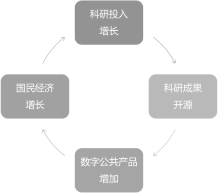

# 第48问 开源如何推动高校科研创新

## 编辑摘要（新增，非原文）

本问围绕“开源如何推动高校科研创新”展开，依次讨论从开源到开放科学；在高校开展开源教育的价值；推动高校的科研成果开源；展望未来的高校科研与开放科学。

## 常见问法（新增检索辅助）

- 开源如何推动高校科研创新？
- 请介绍从开源到开放科学。
- 请介绍在高校开展开源教育的价值。
- 请介绍推动高校的科研成果开源。

## 原书正文（转录）

> 保留原书观点与历史案例，未作当前事实更新。正文页码按书内印刷页码；PDF页码从1起，等于书内页码加18。图示保留原图，文字说明标为整理转述。

<!-- source: q048; print_pages: 178; pdf_pages: 196–196 -->

在第42 问中，我们探讨了开源驱动创新的六大核心机制，这些机制在推动高校的科研创新方面，同样有效。例如，在全球学术协作领域，开源透明协作模式催生了各类开放科学尝试，通过使用开源工具可全面降低科研创新成本，同时已有大量高校开源项目走出校园、在全球范围获得广泛应用并成为事实标准，这些均为相关典型案例。

在本问中，我们将进一步讨论开源为高校科研创新带来的各种实际效果。

### 48.1 从开源到开放科学

根据英文版维基百科，开放科学是一场旨在使科学研究（包括出版物、数据、物理样本和软件）及其传播渠道能够被社会各界人士─无论是业余爱好者还是专业人士，轻松获取的运动。它代表着一种透明且易于接近的知识体系，通过协作网络进行共享和发展。这一概念涵盖多项实践，例如，发布开放式研究成果、倡导开放访问、鼓励科学家采用开放笔记式科学方法（如公开分享数据和代码）、推动更广泛的知识传播与公众参与，以及整体上简化科学知识的出版、获取和交流过程。

开放科学包括以下几个核心原则。

- 开放访问（Open Access）：研究论文和出版物免费提供给公众，而非局限于付费订阅。

- 开放数据（Open Data）：研究数据公开共享，便于他人复用和验证。

- 开放方法（Open Methodology）：公开实验设计、代码和分析流程，以确保研究的透明度和可重复性。

- 开放教育资源（Open Educational Resources）：共享教学材料和工具。

- 公民科学（Citizen Science）：鼓励非专业人士参与科学研究。

联合国教科文组织（UNESCO）在2021 年通过的《开放科学建议书》，将开放科学定义为“使科学知识开放、包容和可持续的实践”。从上述的介绍可以看到，开源对于开放科学的启发与影响是巨大的，可以认为开放科学是开源在科研领域的深化与扩展，其背后的理念一以贯之：开放共享、促进协作、推动创新。

<!-- source: q048; print_pages: 178–179; pdf_pages: 196–197 -->

为推动落实联合国教科文组织《开放科学建议书》，推动中国积极融入全球开放科学实践，提升科技文献和科学数据开放共享水平，促进与国际科技界的开放、信任、合作，在2022 年，中国科学技术协会倡议成立了“开放科学促进联合体”。并在开放获取、开放数据、开放科学基础设施，以及联合体运行机制建设等方面持续探索。在2025 年9 月，260 家科技共同体还发布了“开放、信任、合作”倡议，建议全体科技共同体成员，真诚携手、共同努力，让科技更好地造福人类，为全世界人民所享、所用、所及，为人类文明的可持续发展作出贡献。

<!-- source: q048; print_pages: 179; pdf_pages: 197–197 -->

### 48.2 在高校开展开源教育的价值

在高校的传统科研与人才培养过程中，一直会提到“产学研合作”，甚至“产学研用一体化”。但是，这样的做法还是存在不少缺憾，而“开源模式”恰恰为这些痛点提供了极具潜力的解决方案。

传统“产学研”合作的主要缺憾是目标冲突与节奏脱节，“学”“研”追求的是论文、基金和学术声誉，周期长，注重理论突破；而“产”追求的是市场份额、利润和快速迭代，周期短，注重实用技术。这种根本性的目标差异，常常导致合作是“同床异梦”，难以形成真正的合力。从学术研究出发的很多项目，其优秀的学术成果停留在论文或实验室原型阶段，无法跨越产品化、商业化的“死亡之谷”。原因在于缺乏中试、工程化、市场验证等中间环节的支持。而且，学生在传统产学研项目中，往往只是完成被分配的、局部的任务，难以窥见全貌，更少参与从创意到落地的全过程，其综合创新能力得不到充分锻炼。

目前，大家正在探索的开源教育，可以被理解为“企业开源→开源课题/开源课程/开源实习→围绕开源项目，开展教学与科研工作”。开源教育通过这样的合作模式为传统的产学研合作带来了新的突破。

- 构建共同的目标生态。所有参与者（高校、企业、个人开发者）围绕一个开源项目形成共同体。项目的成功和繁荣是所有人的共同目标。高校可以借此发表高水平论文，企业可以降低研发成本、招募人才、建立生态，个人可以获得成长。目标在项目生态中实现了统一。

- 建立“天然”的知识交换网络。开源社区本身就是一个7×24 小时运转的全球知识市场。代码、文档、讨论区、邮件列表都是知识流动的载体。这种流动是自发的、持续的、透明的，打破了机构围墙。

- 实现“接力式”创新与平滑过渡。一个开源项目可以从高校的实验室原型开始，吸引企业开发者加入进行工程化加固；初创公司可以基于此推出商业版；其他公司可以将其集成到产品中。创新不再是“交接”，而是“接力”，整个过程在开放环境中自然发生，大大降低了转化门槛。

- 提供深度实践的“真实战场”。学生不再是被动的任务执行者，而是社区的平等贡献者。他们需要理解项目架构、与全球开发者协作、提交代码、参与评审。这培养的不仅是技术能力，更是沟通、项目管理、社区运营等综合能力。一份优秀的开源贡献履历，是通往顶级公司的黄金门票。

- 采用预先的、标准化的许可协议。通常，开源项目从一开始就采用明确的开源许可证（如Apache-2.0、GPL）。这预先规定了各方的权利和义务，极大地简化了法律问题。合作的焦点从“如何分配所有权”转向了“如何共同把蛋糕做大”。

<!-- source: q048; print_pages: 180; pdf_pages: 198–198 -->

目前，我国的产学研各界正在积极协作，探索开源教育的更多可能。例如，清华大学、北京航空航天大学等25 所高校联合成立“以贡献为导向的开源人才评价机制试点工作组”，将开源贡献纳入学生学分认证和教师成果评定体系。开放原子基金会推动的“校源行”活动已覆盖多所高校，形成课程、师资、实践项目一体化的开源教育模式。2025 年，天工开物开源基金会还设立了开源教育奖学金，评选优秀课程、导师及学生开源项目。

### 48.3 推动高校的科研成果开源

在2024 年中国科学院的院刊上，发表了隆云滔等专家联合撰写的一篇文章《推动国家资助科研项目成果开源开放的国际经验借鉴及思考》。在这篇文章中，系统性地阐述了在中国数字经济时代背景下，推动国家财政资助科研项目成果开源开放的战略意义、国际经验、现实挑战及政策建议。可以期待，开源对于科研创新的影响与促进，有望从“自然而然”阶段进入“国家政策推动”阶段。

文章开篇就特别强调了“开源创新成为数字时代全球数字公共产品供给的关键来源”，这样的数字公共产品的供给，对于整个国民经济和社会的高质量发展，起到了关键甚至是无可替代的作用。从财政资金的角度来看，采取开源开放路径有助于减少科技项目重复投入困境，优化财政资金分配，确保资源的有效利用，从而取得更高质量和更高效率的成果，同时也能促进经济的增长。另外，开源开放也有助于推进科研创新水平突破，从而形成正向循环，如图48-1 所示。

**图示文字说明（整理转述）**：图示的正向循环为：科研投入增长→科研成果开源→数字公共产品增加→国民经济增长→科研投入增长。

图48-1 科研成果开源推动的正向循环

对比GitHub、Hagging Face 这样的开源代码/开源AI 托管平台，我们还缺少一个开放科学成果的展示、协作、交流的托管平台。因此，在文章中，专家们也建议“搭建国家开源开放的科技成果运营平台”，不仅是要促进国内科研成果的交流推广，更希望融入全球数字公共产品的联合建设和推广中，使更多中国数字化成果得到认可和推广。

<!-- source: q048; print_pages: 181; pdf_pages: 199–199 -->

### 48.4 展望未来的高校科研与开放科学

随着上文的思路，我们可以进一步展望一下，如果将开源实践全面引入高校科研领域，将会发生哪些变化？

- 科研论文的发布将会加上版本号：从最开始的0.1 版到0.2 版，每次发布都会添加一个感谢列表，列出为这个最新版本的成果作出贡献的所有参与者。

- 从可阅读的论文到可执行的论文：2025 年4 月，一个韩国开源项目Paper2Code 横空出世，这是一个基于机器学习实现的从科学论文自动生成代码的工具。我们都知道，可重复性（Reproducibility）是科学进步的核心。而这样的项目，就是在AI 的帮助下，进一步将可重复性做到极致。虽然目前的Paper2Code 还只能转换机器学习领域的论文，但是我们的确可以期待更多。

- 从IDE 到IRE：IDE 是软件工程师都非常熟悉的集成开发环境，但是对于科研工作者，还缺少一套“集成科研环境（IRE）”。如果能够出现这样一种开源工具，同现在的主流IDE 一样，允许安装各种各样的辅助插件，针对不同类型的科研工作，科学家们可以自由选择安装各种不同的研究辅助工具，从而彻底改变现在各类开源科研工具分散、小众、开发者与用户互相找不到对方的窘境。

- 从GitHub 到Open Data Hub：目前已经有各种正在建设中的开放数据集，根据2024 年《开放数据状态报告》（State of Open Data 2024）显示，开放数据实践正处于成为全球认可标准的边缘，政策环境是关键驱动因素。许多国家（如美国、英国、德国和法国）的开放数据库共享率达25%左右，而“按需共享”比例下降了1%～9%。报告建议通过政策、合规监测和培训来进一步推动。所以，未来是否有可能建成一个全球皆可访问、所有数据都能够找到的Open Data Hub，我们还处在热切地期盼之中。

这不仅是技术的升级，更是一场深刻的科研文化变革。从论文的版本化管理，到AI 赋能的可执行论文，再到一体化的科研环境与全球数据枢纽，开源实践将如同一股活水，注入高校科研的土壤，催生协作、透明与高效的新生态。目前，我们正站在这样一个拐点：开源精神将如同当年的印刷术与互联网一般，从根本上加速人类知识的循环与创新。当全球智慧在开放协作中汇聚，我们迎来的将是一个真正“群星闪耀”的科学新时代。

## 来源与整理说明

来源：《解码开源：开源生态60问》，庄表伟，第48问；书内第178–181页；PDF第196–199页。
拟定网页路径：`/questions/q048/`（尚未发布）。
摘要、关键词、常见问法与图示说明为新增整理内容；正文与表格保留原稿内容。